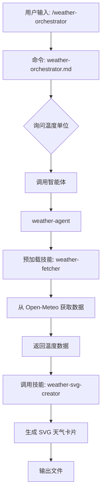

# Claude Code Best Practice 网站实现方案

## 🎯 项目目标

将 claude-code-best-practice 项目转换为一个现代化的技术博客网站，完整展示所有教程、文档和资源。

---

## 📋 方案对比

### 方案一：VitePress（推荐）⭐⭐⭐⭐⭐

**技术栈**: VitePress + Vue 3 + TypeScript

**优势**:
- ✅ 专为技术文档设计，完美支持 Markdown
- ✅ 超快的构建速度和开发体验（基于 Vite）
- ✅ 内置搜索、侧边栏、导航栏
- ✅ 支持 Vue 组件嵌入，可扩展性强
- ✅ SEO 友好，支持 SSR
- ✅ 主题精美，专业感强
- ✅ 零配置即可使用现有 Markdown 文件

**适用场景**: 
- 技术文档网站
- 教程博客
- API 文档

**预估工时**: 2-3天

---

### 方案二：Docusaurus

**技术栈**: Docusaurus + React + TypeScript

**优势**:
- ✅ Meta 出品，生态成熟
- ✅ 支持版本化文档
- ✅ 强大的插件系统
- ✅ 国际化支持好
- ✅ 博客功能完善

**适用场景**:
- 需要多版本文档
- 大型开源项目
- 需要复杂博客功能

**预估工时**: 3-5天

---

### 方案三：Astro + Content Collections

**技术栈**: Astro + Markdown + React/Vue/Svelte

**优势**:
- ✅ 性能极致（零 JS 默认）
- ✅ 支持多框架组件
- ✅ 内置 Content Collections 管理内容
- ✅ 灵活度高，设计自由

**适用场景**:
- 追求极致性能
- 需要高度定制化设计
- 混合使用多个框架

**预估工时**: 4-6天

---

### 方案四：Nextra

**技术栈**: Next.js + MDX + Tailwind CSS

**优势**:
- ✅ 基于 Next.js，功能强大
- ✅ 支持 MDX（Markdown + JSX）
- ✅ 主题简洁现代
- ✅ 部署灵活（Vercel 一键部署）

**适用场景**:
- 需要 Next.js 生态
- 需要交互式示例
- 需要动态功能

**预估工时**: 3-4天

---

## 🏆 推荐方案：VitePress

### 网站结构设计

```
docs/
├── .vitepress/
│   ├── config.ts              # 网站配置
│   ├── theme/                 # 自定义主题
│   │   ├── index.ts
│   │   ├── components/        # Vue 组件
│   │   └── styles/            # 自定义样式
│   └── dist/                  # 构建输出
│
├── index.md                   # 首页
├── guide/                     # 入门指南
│   ├── index.md
│   ├── getting-started.md
│   └── concepts.md
│
├── best-practice/             # 最佳实践（直接使用现有文件）
│   ├── index.md
│   ├── claude-commands.md
│   ├── claude-skills.md
│   ├── claude-subagents.md
│   └── ...
│
├── reports/                   # 技术报告
│   ├── index.md
│   └── ...
│
├── implementation/            # 实现示例
│   ├── index.md
│   └── ...
│
├── workflows/                 # 开发工作流
│   ├── index.md
│   ├── orchestration/
│   └── cross-model/
│
├── tips/                      # 技巧集锦
│   ├── index.md
│   ├── boris-tips/
│   └── team-tips/
│
├── videos/                    # 视频笔记
│   ├── index.md
│   └── ...
│
├── tutorial/                  # 教程
│   ├── index.md
│   └── day0/
│
└── resources/                 # 资源中心
    ├── tools.md
    ├── community.md
    └── faq.md
```

---

## 🎨 网站设计方案

### 1. 首页（Landing Page）

```markdown
# 首页布局

┌─────────────────────────────────────────────┐
│  Header: Logo | 导航栏 | 搜索 | GitHub      │
├─────────────────────────────────────────────┤
│                                             │
│         🚀 Hero Section                     │
│  Claude Code Best Practice                  │
│  从氛围编程到智能体工程                        │
│  [开始学习] [查看 GitHub]                    │
│                                             │
├─────────────────────────────────────────────┤
│                                             │
│         ✨ 特色亮点（3列卡片）                │
│  📚 完整知识体系  💡 69条技巧  🎯 10大工作流   │
│                                             │
├─────────────────────────────────────────────┤
│                                             │
│         📊 项目统计                          │
│  102个文件翻译  96.23%完成  GitHub Trending  │
│                                             │
├─────────────────────────────────────────────┤
│                                             │
│         🎓 快速开始                          │
│  1. 理论学习  2. 实践操作  3. 应用到项目     │
│                                             │
├─────────────────────────────────────────────┤
│                                             │
│         🎬 精选视频                          │
│  Boris Cherny 访谈系列（卡片展示）            │
│                                             │
├─────────────────────────────────────────────┤
│  Footer: 社交链接 | 相关项目 | 版权信息       │
└─────────────────────────────────────────────┘
```

### 2. 导航结构

```
顶部导航：
┌─────────────────────────────────────────────┐
│ Logo  指南  最佳实践  工作流  技巧  资源  🔍  │
└─────────────────────────────────────────────┘

侧边栏（根据当前路由动态切换）：
┌──────────────────┐
│ 📖 指南          │
│  ├─ 快速开始     │
│  ├─ 核心概念     │
│  └─ 学习路径     │
│                  │
│ 🎯 最佳实践      │
│  ├─ 命令         │
│  ├─ 技能         │
│  ├─ 子智能体     │
│  ├─ 设置         │
│  └─ ...          │
│                  │
│ 🔧 开发工作流    │
│  ├─ 编排工作流   │
│  ├─ 跨模型工作流 │
│  └─ RPI 工作流   │
│                  │
│ 💡 技巧集锦      │
│ 📊 技术报告      │
│ 💻 实现示例      │
│ 🎬 视频笔记      │
│ 📚 资源中心      │
└──────────────────┘
```

---

## 🛠️ 技术实现细节

### VitePress 配置示例

```typescript
// .vitepress/config.ts
import { defineConfig } from 'vitepress'

export default defineConfig({
  title: 'Claude Code Best Practice',
  description: '从氛围编程到智能体工程 - 熟能生巧，让 Claude 完美运作',
  
  // 主题配置
  themeConfig: {
    // 顶部导航
    nav: [
      { text: '指南', link: '/guide/' },
      { text: '最佳实践', link: '/best-practice/' },
      { text: '工作流', link: '/workflows/' },
      { text: '技巧', link: '/tips/' },
      { 
        text: '资源', 
        items: [
          { text: '视频教程', link: '/videos/' },
          { text: '技术报告', link: '/reports/' },
          { text: '实现示例', link: '/implementation/' },
          { text: 'FAQ', link: '/resources/faq' }
        ]
      }
    ],
    
    // 侧边栏
    sidebar: {
      '/guide/': [
        {
          text: '开始',
          items: [
            { text: '简介', link: '/guide/' },
            { text: '快速开始', link: '/guide/getting-started' },
            { text: '核心概念', link: '/guide/concepts' }
          ]
        }
      ],
      '/best-practice/': [
        {
          text: '最佳实践',
          items: [
            { text: '概览', link: '/best-practice/' },
            { text: '命令', link: '/best-practice/claude-commands' },
            { text: '技能', link: '/best-practice/claude-skills' },
            { text: '子智能体', link: '/best-practice/claude-subagents' },
            { text: '设置', link: '/best-practice/claude-settings' },
            { text: 'MCP', link: '/best-practice/claude-mcp' },
            { text: '内存', link: '/best-practice/claude-memory' },
            { text: '增强功能', link: '/best-practice/claude-power-ups' },
            { text: 'CLI 启动标志', link: '/best-practice/claude-cli-startup-flags' }
          ]
        }
      ],
      '/workflows/': [
        {
          text: '开发工作流',
          items: [
            { text: '概览', link: '/workflows/' },
            { text: '编排工作流', link: '/workflows/orchestration' },
            { text: '跨模型工作流', link: '/workflows/cross-model' },
            { text: 'RPI 工作流', link: '/workflows/rpi' }
          ]
        },
        {
          text: '10大工作流对比',
          items: [
            { text: 'Everything Claude Code', link: '/workflows/ecc' },
            { text: 'Superpowers', link: '/workflows/superpowers' },
            { text: 'Spec Kit', link: '/workflows/spec-kit' },
            // ... 其他工作流
          ]
        }
      ],
      '/tips/': [
        {
          text: '技巧集锦',
          items: [
            { text: '全部技巧', link: '/tips/' },
            { text: 'Boris 13条技巧', link: '/tips/boris-13-tips' },
            { text: 'Boris 10条技巧', link: '/tips/boris-10-tips' },
            { text: 'Boris 15条技巧', link: '/tips/boris-15-tips' },
            { text: 'Thariq 技巧', link: '/tips/thariq-tips' }
          ]
        },
        {
          text: '分类技巧',
          items: [
            { text: '提示技巧', link: '/tips/prompting' },
            { text: '计划规范', link: '/tips/planning' },
            { text: 'CLAUDE.md', link: '/tips/claudemd' },
            { text: '智能体', link: '/tips/agents' },
            { text: '工作流', link: '/tips/workflows' },
            { text: 'Git/PR', link: '/tips/git-pr' },
            { text: '调试', link: '/tips/debugging' }
          ]
        }
      ]
    },
    
    // 社交链接
    socialLinks: [
      { icon: 'github', link: 'https://github.com/yq-pop/claude-code-best' }
    ],
    
    // 搜索
    search: {
      provider: 'local'
    },
    
    // 页脚
    footer: {
      message: '基于 MIT 协议发布',
      copyright: 'Copyright © 2026 Claude Code Best Practice'
    },
    
    // 编辑链接
    editLink: {
      pattern: 'https://github.com/yq-pop/claude-code-best/edit/main/docs/:path',
      text: '在 GitHub 上编辑此页'
    },
    
    // 最后更新时间
    lastUpdated: {
      text: '最后更新于',
      formatOptions: {
        dateStyle: 'full',
        timeStyle: 'short'
      }
    }
  },
  
  // Markdown 配置
  markdown: {
    lineNumbers: true,
    theme: 'github-dark',
    // 代码组
    config: (md) => {
      // 自定义 Markdown 插件
    }
  }
})
```

---

## 🎨 自定义主题和组件

### 自定义 Vue 组件

```vue
<!-- .vitepress/theme/components/WorkflowCard.vue -->
<template>
  <div class="workflow-card">
    <div class="workflow-header">
      <h3>{{ title }}</h3>
      <div class="workflow-stars">⭐ {{ stars }}</div>
    </div>
    <div class="workflow-badges">
      <span v-for="badge in badges" :key="badge" class="badge">
        {{ badge }}
      </span>
    </div>
    <div class="workflow-stats">
      <div class="stat">
        <span class="stat-label">智能体</span>
        <span class="stat-value">{{ agents }}</span>
      </div>
      <div class="stat">
        <span class="stat-label">命令</span>
        <span class="stat-value">{{ commands }}</span>
      </div>
      <div class="stat">
        <span class="stat-label">技能</span>
        <span class="stat-value">{{ skills }}</span>
      </div>
    </div>
    <a :href="link" class="workflow-link">查看详情 →</a>
  </div>
</template>

<script setup lang="ts">
defineProps<{
  title: string
  stars: string
  badges: string[]
  agents: number
  commands: number
  skills: number
  link: string
}>()
</script>

<style scoped>
.workflow-card {
  border: 1px solid var(--vp-c-divider);
  border-radius: 8px;
  padding: 24px;
  transition: all 0.3s;
}

.workflow-card:hover {
  border-color: var(--vp-c-brand);
  box-shadow: 0 4px 12px rgba(0, 0, 0, 0.1);
}
/* ... 更多样式 */
</style>
```

```vue
<!-- .vitepress/theme/components/TipCard.vue -->
<template>
  <div class="tip-card" :class="`tip-${type}`">
    <div class="tip-icon">{{ icon }}</div>
    <div class="tip-content">
      <div class="tip-title">{{ title }}</div>
      <div class="tip-description"><slot /></div>
      <div v-if="source" class="tip-source">
        来源: <a :href="sourceLink">{{ source }}</a>
      </div>
    </div>
  </div>
</template>

<script setup lang="ts">
defineProps<{
  type: 'prompting' | 'planning' | 'claudemd' | 'agents' | 'workflows'
  title: string
  icon: string
  source?: string
  sourceLink?: string
}>()
</script>
```

```vue
<!-- .vitepress/theme/components/VideoCard.vue -->
<template>
  <div class="video-card">
    <div class="video-thumbnail">
      
      <div class="video-duration">{{ duration }}</div>
    </div>
    <div class="video-info">
      <h4>{{ title }}</h4>
      <p class="video-author">{{ author }}</p>
      <p class="video-date">{{ date }}</p>
      <div class="video-actions">
        <a :href="youtubeLink" class="btn-youtube">YouTube</a>
        <a :href="notesLink" class="btn-notes">查看笔记</a>
      </div>
    </div>
  </div>
</template>
```

---

## 📊 特色功能实现

### 1. 交互式流程图

使用 Mermaid.js 展示工作流：

```markdown
---
# 在 Markdown 中嵌入
---

## 天气系统工作流


```

### 2. 搜索优化

```typescript
// 添加自定义搜索索引
export default defineConfig({
  themeConfig: {
    search: {
      provider: 'local',
      options: {
        // 自定义搜索选项
        detailedView: true,
        // 排除某些路径
        exclude: ['changelog/**'],
        // 自定义转换器
        _render(src, env, md) {
          // 处理特殊语法
        }
      }
    }
  }
})
```

### 3. 代码演示

```vue
<!-- CodeDemo.vue - 可运行的代码示例 -->
<template>
  <div class="code-demo">
    <div class="demo-tabs">
      <button 
        v-for="tab in tabs" 
        :key="tab"
        @click="activeTab = tab"
        :class="{ active: activeTab === tab }"
      >
        {{ tab }}
      </button>
    </div>
    <div class="demo-content">
      <pre v-if="activeTab === 'Code'"><code>{{ code }}</code></pre>
      <div v-else-if="activeTab === 'Preview'" v-html="preview"></div>
      <div v-else class="demo-explanation">{{ explanation }}</div>
    </div>
  </div>
</template>
```

### 4. 进度追踪

```vue
<!-- ProgressTracker.vue - 学习进度追踪 -->
<template>
  <div class="progress-tracker">
    <h3>📊 学习进度</h3>
    <div class="progress-section">
      <div class="section-title">理论学习</div>
      <div class="progress-bar">
        <div class="progress-fill" :style="{ width: theory + '%' }"></div>
      </div>
      <span>{{ theory }}%</span>
    </div>
    <div class="progress-section">
      <div class="section-title">实践操作</div>
      <div class="progress-bar">
        <div class="progress-fill" :style="{ width: practice + '%' }"></div>
      </div>
      <span>{{ practice }}%</span>
    </div>
    <div class="progress-section">
      <div class="section-title">项目应用</div>
      <div class="progress-bar">
        <div class="progress-fill" :style="{ width: application + '%' }"></div>
      </div>
      <span>{{ application }}%</span>
    </div>
  </div>
</template>
```

### 5. 互动式 Checklist

```vue
<!-- LearningChecklist.vue -->
<template>
  <div class="learning-checklist">
    <h3>✅ 学习清单</h3>
    <div 
      v-for="item in items" 
      :key="item.id"
      class="checklist-item"
    >
      <input 
        type="checkbox" 
        :id="item.id"
        v-model="item.completed"
        @change="saveProgress"
      />
      <label :for="item.id">{{ item.text }}</label>
    </div>
  </div>
</template>

<script setup lang="ts">
import { ref, onMounted } from 'vue'

const items = ref([
  { id: '1', text: '阅读 README.md', completed: false },
  { id: '2', text: '理解 8 大核心概念', completed: false },
  { id: '3', text: '观看 Boris Cherny 访谈', completed: false },
  { id: '4', text: '运行天气工作流示例', completed: false },
  // ... 更多项目
])

const saveProgress = () => {
  localStorage.setItem('learning-progress', JSON.stringify(items.value))
}

onMounted(() => {
  const saved = localStorage.getItem('learning-progress')
  if (saved) {
    items.value = JSON.parse(saved)
  }
})
</script>
```

---

## 🚀 部署方案

### 方案 1：GitHub Pages（免费）

```bash
# 构建
npm run build

# 部署到 GitHub Pages
npm run deploy
```

`.github/workflows/deploy.yml`:
```yaml
name: Deploy to GitHub Pages

on:
  push:
    branches:
      - main

jobs:
  deploy:
    runs-on: ubuntu-latest
    steps:
      - uses: actions/checkout@v3
      
      - name: Setup Node.js
        uses: actions/setup-node@v3
        with:
          node-version: 18
          
      - name: Install dependencies
        run: npm ci
        
      - name: Build
        run: npm run build
        
      - name: Deploy
        uses: peaceiris/actions-gh-pages@v3
        with:
          github_token: ${{ secrets.GITHUB_TOKEN }}
          publish_dir: ./docs/.vitepress/dist
```

### 方案 2：Vercel（推荐）

1. 连接 GitHub 仓库
2. 配置构建命令：`npm run build`
3. 配置输出目录：`docs/.vitepress/dist`
4. 自动部署

### 方案 3：Netlify

```toml
# netlify.toml
[build]
  command = "npm run build"
  publish = "docs/.vitepress/dist"

[[redirects]]
  from = "/*"
  to = "/index.html"
  status = 200
```

### 方案 4：Cloudflare Pages

直接连接 GitHub，自动识别 VitePress 项目并部署。

---

## 📝 内容迁移清单

### 自动化脚本

```javascript
// scripts/migrate-content.js
import fs from 'fs'
import path from 'path'

const sourceDirs = [
  'best-practice',
  'reports',
  'implementation',
  'tips',
  'videos',
  'tutorial'
]

const targetDir = 'docs'

// 复制文件并添加 frontmatter
function migrateFile(source, target) {
  const content = fs.readFileSync(source, 'utf-8')
  
  // 提取标题
  const titleMatch = content.match(/^#\s+(.+)$/m)
  const title = titleMatch ? titleMatch[1] : path.basename(source, '.md')
  
  // 添加 frontmatter
  const newContent = `---
title: ${title}
description: ${title}
---

${content}`
  
  fs.writeFileSync(target, newContent)
}

// 遍历并迁移所有文件
sourceDirs.forEach(dir => {
  // 实现递归复制逻辑
})
```

### 手动调整清单

- [ ] 调整所有内部链接路径
- [ ] 添加 frontmatter 到每个 Markdown 文件
- [ ] 创建索引页（index.md）
- [ ] 优化图片路径
- [ ] 添加面包屑导航
- [ ] 配置重定向规则
- [ ] 创建自定义 404 页面

---

## 🎯 实施步骤

### 第一周：基础搭建

**Day 1-2: 项目初始化**
```bash
# 1. 创建 VitePress 项目
npm create vitepress@latest docs

# 2. 安装依赖
cd docs
npm install

# 3. 启动开发服务器
npm run dev
```

**Day 3-4: 配置和主题**
- 配置 `.vitepress/config.ts`
- 设计导航结构
- 自定义主题样式
- 创建首页

**Day 5-7: 内容迁移**
- 批量迁移 Markdown 文件
- 调整链接和图片路径
- 添加 frontmatter
- 创建索引页

### 第二周：功能开发

**Day 8-10: 自定义组件**
- 开发 WorkflowCard 组件
- 开发 TipCard 组件
- 开发 VideoCard 组件
- 开发 ProgressTracker 组件

**Day 11-12: 特色功能**
- 集成 Mermaid.js
- 添加代码演示功能
- 实现搜索优化
- 添加学习进度追踪

**Day 13-14: 优化和测试**
- 性能优化
- SEO 优化
- 移动端适配
- 浏览器兼容性测试

### 第三周：部署和完善

**Day 15-16: 部署**
- 配置 CI/CD
- 部署到 Vercel/Netlify
- 配置自定义域名
- SSL 证书配置

**Day 17-18: 内容完善**
- 补充遗漏内容
- 优化用户体验
- 添加分析工具（Google Analytics）
- 性能监控

**Day 19-21: 文档和维护**
- 编写贡献指南
- 设置自动更新流程
- 社区推广
- 收集反馈

---

## 💰 成本估算

### 免费方案
- **托管**: GitHub Pages / Vercel / Netlify（免费）
- **域名**: 可选（约 $10-15/年）
- **总成本**: $0 - $15/年

### 付费方案（可选）
- **Vercel Pro**: $20/月（更多带宽和功能）
- **自定义域名**: $10-15/年
- **CDN 加速**: 可选
- **分析工具**: Google Analytics（免费）

---

## 📊 效果预期

### 性能指标
- ⚡ Lighthouse 分数 > 95
- 🚀 首次加载 < 2秒
- 📱 移动端完美适配
- 🔍 SEO 分数 > 90

### 用户体验
- ✅ 直观的导航结构
- ✅ 快速的搜索功能
- ✅ 响应式设计
- ✅ 离线访问支持（PWA）

### 维护成本
- 📝 内容更新：自动同步 GitHub
- 🔄 部署：自动化 CI/CD
- 💰 运营成本：几乎为零

---

## 🎨 设计参考

### 优秀案例

1. **Vue.js 官方文档** - https://vuejs.org
   - 清晰的导航结构
   - 优秀的代码示例
   - 交互式教程

2. **Vite 官方文档** - https://vitejs.dev
   - 现代化设计
   - 性能优秀
   - 多语言支持

3. **Astro 文档** - https://docs.astro.build
   - 精美的视觉设计
   - 清晰的内容组织
   - 丰富的示例

---

## 🔧 维护计划

### 自动化更新

```yaml
# .github/workflows/sync-content.yml
name: Sync Content

on:
  push:
    branches:
      - main
    paths:
      - 'best-practice/**'
      - 'reports/**'
      - 'tips/**'

jobs:
  sync:
    runs-on: ubuntu-latest
    steps:
      - name: Sync to docs folder
        run: |
          npm run migrate-content
          git add docs/
          git commit -m "chore: sync content"
          git push
```

### 内容审查流程

1. PR 提交 → 自动构建预览
2. 内容审查 → 检查链接和格式
3. 合并 → 自动部署到生产环境

---

## 📈 后续增强

### Phase 2 功能

- [ ] 用户评论系统（giscus）
- [ ] 文章评分功能
- [ ] 学习路径推荐
- [ ] AI 问答助手（基于文档内容）
- [ ] 多语言支持（英文版）
- [ ] 暗色模式切换
- [ ] 代码在线运行（CodeSandbox 集成）
- [ ] 订阅邮件通知

### Phase 3 功能

- [ ] 社区投稿系统
- [ ] 案例库展示
- [ ] 互动式练习
- [ ] 视频课程平台
- [ ] 认证体系
- [ ] 技能树可视化

---

## 🎯 总结

**推荐实施方案：VitePress + GitHub Pages/Vercel**

**优势**：
1. ✅ 完美适配现有 Markdown 内容
2. ✅ 零成本部署和维护
3. ✅ 自动化 CI/CD
4. ✅ 性能和 SEO 优秀
5. ✅ 开发效率高（2-3周完成）

**下一步行动**：
1. 🚀 初始化 VitePress 项目
2. 📝 配置网站结构
3. 🎨 设计首页和主题
4. 📦 批量迁移内容
5. 🌐 部署上线

**预计时间线**：3周完成基础版本，持续优化增强功能。

---

*文档版本：v1.0*  
*创建日期：2026年4月11日*
