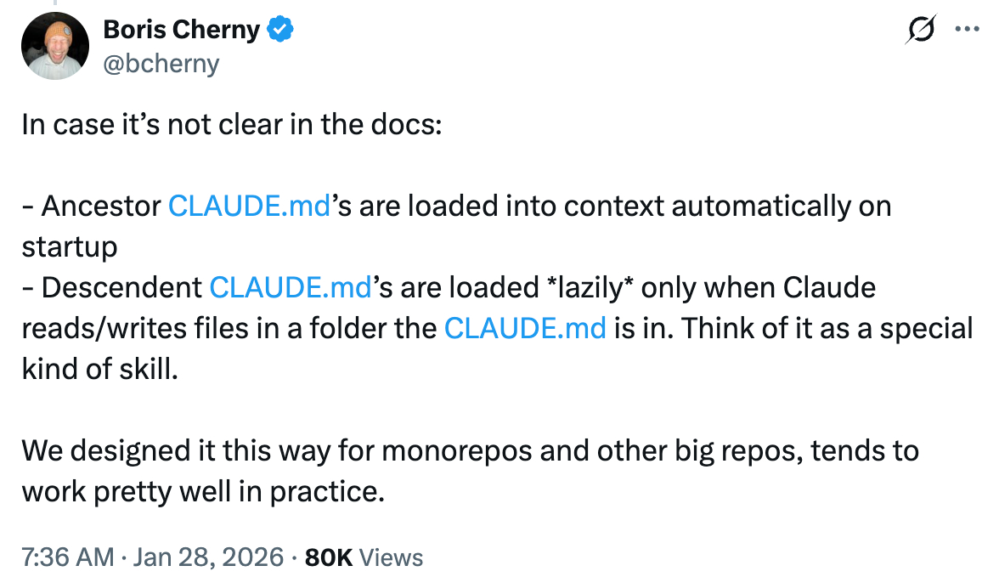

# Claude 记忆

通过 CLAUDE.md 文件实现持久化上下文 — 如何编写它们以及它们在 monorepo 中如何加载。

<table width="100%">
<tr>
<td><a href="../">← 返回 Claude Code 最佳实践</a></td>
<td align="right"></td>
</tr>
</table>

---

## 1. 编写好的 CLAUDE.md

结构良好的 CLAUDE.md 是改善 Claude Code 为您的项目输出的最具影响力的方式。Humanlayer 有一个优秀的指南,涵盖了要包含的内容、如何构建以及常见陷阱。

- [Humanlayer - Writing a good Claude.md](https://www.humanlayer.dev/blog/writing-a-good-claude-md)

---

## 2. 大型 Monorepo 中的 CLAUDE.md

在 monorepo 中使用 Claude Code 时,了解 CLAUDE.md 文件如何加载到上下文中对于有效组织项目指令至关重要。

<p align="center">
  <a href="https://x.com/bcherny/status/2016339448863355206"></a>
</p>

### 两种加载机制

Claude Code 使用两种不同的机制加载 CLAUDE.md 文件:

#### 祖先加载(向上遍历目录树)

当您启动 Claude Code 时,它会从当前工作目录**向上**遍历到文件系统根目录,并加载沿途找到的每个 CLAUDE.md。这些文件在**启动时立即加载**。

#### 后代加载(向下遍历目录树)

当前工作目录下子目录中的 CLAUDE.md 文件在启动时**不会加载**。它们仅在 Claude 在会话期间读取这些子目录中的文件时才包含在内。这被称为**延迟加载**。

### 示例 Monorepo 结构

考虑一个具有不同组件独立目录的典型 monorepo:

```
/mymonorepo/
├── CLAUDE.md          # 根级指令(跨所有组件共享)
├── frontend/
│   └── CLAUDE.md      # 前端特定指令
├── backend/
│   └── CLAUDE.md      # 后端特定指令
└── api/
    └── CLAUDE.md      # API 特定指令
```

### 场景 1: 从根目录运行 Claude Code

当您从 `/mymonorepo/` 运行 Claude Code 时:

```bash
cd /mymonorepo
claude
```

| 文件 | 启动时加载? | 原因 |
|------|-------------------|--------|
| `/mymonorepo/CLAUDE.md` | 是 | 这是您的当前工作目录 |
| `/mymonorepo/frontend/CLAUDE.md` | 否 | 仅在您读取/编辑 `frontend/` 中的文件时加载 |
| `/mymonorepo/backend/CLAUDE.md` | 否 | 仅在您读取/编辑 `backend/` 中的文件时加载 |
| `/mymonorepo/api/CLAUDE.md` | 否 | 仅在您读取/编辑 `api/` 中的文件时加载 |

### 场景 2: 从组件目录运行 Claude Code

当您从 `/mymonorepo/frontend/` 运行 Claude Code 时:

```bash
cd /mymonorepo/frontend
claude
```

| 文件 | 启动时加载? | 原因 |
|------|-------------------|--------|
| `/mymonorepo/CLAUDE.md` | 是 | 这是一个祖先目录 |
| `/mymonorepo/frontend/CLAUDE.md` | 是 | 这是您的当前工作目录 |
| `/mymonorepo/backend/CLAUDE.md` | 否 | 目录树的不同分支 |
| `/mymonorepo/api/CLAUDE.md` | 否 | 目录树的不同分支 |

### 关键要点

1. **祖先始终在启动时加载** — Claude 向上遍历目录树并加载它找到的所有 CLAUDE.md 文件。这确保您始终可以访问根级别、仓库范围的指令。

2. **后代延迟加载** — 子目录 CLAUDE.md 文件仅在您与这些子目录中的文件交互时加载。这防止不相关的上下文使您的会话膨胀。

3. **同级永不加载** — 如果您在 `frontend/` 中工作,您不会将 `backend/CLAUDE.md` 或 `api/CLAUDE.md` 加载到上下文中。

4. **全局 CLAUDE.md** — 您还可以在主文件夹中的 `~/.claude/CLAUDE.md` 放置一个 CLAUDE.md,它适用于所有 Claude Code 会话,无论项目如何。

### 为什么这种设计适用于 Monorepo

- **共享指令向下传播** — 根级别的 CLAUDE.md 包含适用于所有地方的仓库范围约定、编码标准和通用模式。

- **组件特定指令保持隔离** — 前端开发人员不需要后端特定的指令使他们的上下文混乱,反之亦然。

- **上下文优化** — 通过延迟加载后代 CLAUDE.md 文件,Claude Code 避免在启动时加载可能数百千字节的不相关指令。

### 最佳实践

1. **在根 CLAUDE.md 中放置共享约定** — 编码标准、提交消息格式、PR 模板和其他仓库范围的指南。

2. **在组件 CLAUDE.md 中放置组件特定指令** — 框架特定模式、组件架构、该组件独有的测试约定。

3. **使用 CLAUDE.local.md 存放个人偏好** — 将其添加到 `.gitignore` 以存放不应与团队共享的指令。

---

## Sources

- [Claude Code Documentation - How Claude Looks Up Memories](https://code.claude.com/docs/en/memory#how-claude-looks-up-memories)
- [Boris Cherny on X - Clarification on CLAUDE.md Loading](https://x.com/bcherny/status/2016339448863355206)
- [Humanlayer - Writing a good Claude.md](https://www.humanlayer.dev/blog/writing-a-good-claude-md)
