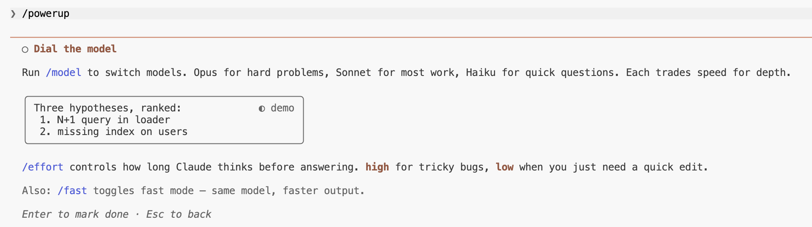

# Power-ups 最佳实践


通过动画演示教授 Claude Code 功能的交互式课程。每个 power-up 教授大多数人错过的 Claude Code 功能。在 v2.1.90 中引入。

<table width="100%">
<tr>
<td><a href="../">← 返回 Claude Code 最佳实践</a></td>
<td align="right"></td>
</tr>
</table>

---

## 用法

```bash
claude
/powerup
```

---

## Power-ups (10)

<p align="center">
  
</p>

| # | Power-up | 主题 |
|---|----------|--------|
| 1 | 与代码库对话 | `@` 文件、行引用 |
| 2 | 使用模式控制 | `shift+tab`、plan、auto |
| 3 | 撤销任何操作 | `/rewind`、`Esc-Esc` |
| 4 | 在后台运行 | 任务、`/tasks` |
| 5 | 教 Claude 您的规则 | `CLAUDE.md`、`/memory` |
| 6 | 使用工具扩展 | MCP、`/mcp` |
| 7 | 自动化您的工作流程 | 技能、钩子 |
| 8 | 倍增您自己 | 子代理、`/agents` |
| 9 | 随处编码 | `/remote-control`、`/teleport` |
| 10 | 调节模型 | `/model`、`/effort` |

---

## 示例:调节模型

最后一个 power-up 通过动画演示教授模型切换和努力控制。

<p align="center">
  
</p>

<p align="center">
  
</p>

<p align="center">
  
</p>

---

## Sources

- [Changelog — v2.1.90](https://code.claude.com/docs/en/changelog)
