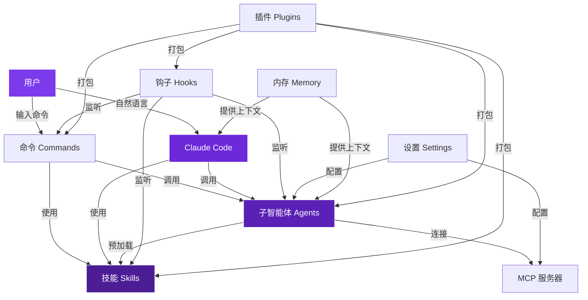

# 核心概念详解

深入理解 Claude Code 的 8 大核心组件，掌握智能体工程的基础。

## 🧠 整体架构

Claude Code 通过 8 大核心组件构建了一个完整的智能体工程系统：

```
用户交互层
    ↓
命令 (Commands) ←→ 技能 (Skills)
    ↓
子智能体 (Agents)
    ↓
钩子 (Hooks) + MCP服务器
    ↓
设置 (Settings) + 内存 (Memory)
    ↓
插件 (Plugins)
```

---

## 1️⃣ 命令 (Commands)

### 📝 什么是命令？

命令是**注入到现有上下文**的提示模板，用于快速调用常用工作流。

### 核心特性

- 🎯 **斜杠调用** - 通过 `/command-name` 快速触发
- 📂 **文件定义** - 存储在 `.claude/commands/<name>.md`
- 🔄 **工作流编排** - 可以调用智能体、技能和其他命令
- 💾 **版本控制** - 提交到 Git，团队共享

### 使用场景

```bash
# 示例：天气工作流命令
/weather-orchestrator

# 其他常见命令
/test          # 运行测试
/review        # 代码审查
/deploy        # 部署流程
/refactor      # 重构建议
```

### 创建你的第一个命令

```markdown
---
# .claude/commands/hello.md
name: hello
description: 一个简单的问候命令
---

你好！我是一个自定义命令。

请执行以下任务：
1. 显示当前项目信息
2. 列出最近的 5 次 Git 提交
3. 统计代码行数
```

👉 [命令最佳实践](/best-practice/claude-commands) | [命令实现示例](/implementation/claude-commands-implementation)

---

## 2️⃣ 技能 (Skills)

### 🎯 什么是技能？

技能是**可配置、可预加载、自动发现**的知识注入，支持渐进式展示和上下文分叉。

### 核心特性

- 📚 **渐进式展示** - 通过子目录组织（references/、examples/、scripts/）
- 🔀 **上下文分叉** - 可在隔离子智能体中运行（`context: fork`）
- 🤖 **智能体预加载** - 通过 `skills:` 字段预加载到智能体
- 🎯 **自动发现** - Claude 根据 `description` 自动识别何时调用

### 技能结构

```
.claude/skills/
└── my-skill/
    ├── SKILL.md           # 主文件（必需）
    ├── references/        # 参考文档（渐进式展示）
    ├── examples/          # 示例代码
    ├── scripts/           # 辅助脚本
    └── config.json        # 配置（可选）
```

### YAML Frontmatter

```yaml
---
name: my-skill
description: 何时调用这个技能（给 Claude 看的）
argument-hint: [参数提示]
user-invocable: true
disable-model-invocation: false
allowed-tools: [Read, Write, Shell]
model: sonnet
context: fork
agent: general-purpose
hooks:
  - PreToolUse
---
```

### 两种技能模式

**1. 智能体技能（预加载）**
```yaml
# .claude/agents/my-agent.md
---
name: my-agent
skills:
  - skill-name-1
  - skill-name-2
---
```

**2. 技能（按需调用）**
```markdown
# 在命令或提示中
请使用 weather-svg-creator 技能生成 SVG 卡片。
```

👉 [技能最佳实践](/best-practice/claude-skills) | [技能实现示例](/implementation/claude-skills-implementation)

---

## 3️⃣ 子智能体 (Agents)

### 🤖 什么是子智能体？

子智能体是在**全新隔离上下文**中运行的自主行动者，拥有自定义工具、权限、模型和持久身份。

### 核心特性

- 🆕 **隔离上下文** - 独立的上下文窗口
- 🔧 **自定义工具** - 限制或扩展可用工具
- 🎨 **自定义模型** - 可选择 haiku、sonnet、opus
- 🧠 **持久内存** - 跨会话记忆（user、project、local）
- 🔐 **权限控制** - 自定义权限模式

### 子智能体定义

```yaml
---
name: weather-agent
description: 获取并处理天气数据。在用户要求天气信息时 PROACTIVELY 调用
tools: Read, Write, Shell, CallMcpTool
disallowedTools: Delete
model: sonnet
permissionMode: acceptEdits
maxTurns: 10
skills:
  - weather-fetcher
mcpServers:
  - open-meteo
hooks:
  - PreToolUse
  - PostToolUse
memory: project
background: false
effort: medium
color: blue
---

# Weather Agent

我是天气智能体，专门负责获取和处理天气数据。

## 我的能力

1. 从 Open-Meteo API 获取实时天气
2. 处理温度单位转换
3. 生成天气可视化卡片

## 预加载的技能

- `weather-fetcher`: 从 API 获取数据的说明
```

### 调用子智能体

```markdown
# 在命令中调用
请使用 weather-agent 子智能体获取天气数据。

# 或在代码中使用 Agent 工具
Agent(
  subagent_type="weather-agent",
  description="获取天气",
  prompt="请获取迪拜的当前温度"
)
```

👉 [子智能体最佳实践](/best-practice/claude-subagents) | [子智能体实现示例](/implementation/claude-subagents-implementation)

---

## 4️⃣ 钩子 (Hooks)

### 🪝 什么是钩子？

钩子是在**特定事件触发时**在智能体循环外运行的用户自定义处理器。

### 支持的钩子事件

| 事件 | 触发时机 | 常见用途 |
|------|----------|----------|
| `PreToolUse` | 工具使用前 | 权限检查、参数验证 |
| `PostToolUse` | 工具使用后 | 自动格式化、日志记录 |
| `Stop` | 回合结束 | 推动继续、验证工作 |
| `UserPromptSubmit` | 用户提交提示 | 声音反馈 |
| `SessionStart` | 会话开始 | 初始化、欢迎消息 |
| `SessionEnd` | 会话结束 | 清理、总结 |

### 钩子示例

```json
{
  "hooks": {
    "PostToolUse": {
      "command": "python .claude/hooks/scripts/format.py"
    },
    "Stop": {
      "agent": "verifier-agent"
    }
  }
}
```

👉 [钩子最佳实践](https://github.com/shanraisshan/claude-code-hooks)

---

## 5️⃣ MCP 服务器

### 🔌 什么是 MCP？

MCP（Model Context Protocol）是连接外部工具、数据库和 API 的协议。

### 配置示例

```json
{
  "mcpServers": {
    "open-meteo": {
      "command": "npx",
      "args": ["-y", "@modelcontextprotocol/server-open-meteo"]
    }
  }
}
```

👉 [MCP 最佳实践](/best-practice/claude-mcp)

---

## 6️⃣ 设置 (Settings)

### ⚙️ 配置层级

1. **托管设置** - 组织强制（最高优先级）
2. **命令行参数** - 单会话覆盖
3. `.claude/settings.local.json` - 个人项目设置
4. `.claude/settings.json` - 团队共享设置
5. `~/.claude/settings.json` - 全局个人默认值

👉 [设置最佳实践](/best-practice/claude-settings)

---

## 7️⃣ 内存 (Memory)

### 🧠 持久化上下文

通过 `CLAUDE.md` 和 `.claude/rules/` 提供持久的项目知识。

### 最佳实践

- 📏 每个文件 **≤ 200 行**
- 🎯 **专注于必要信息**，避免显而易见的内容
- 📂 使用 `.claude/rules/` 拆分大型指令
- 🏢 Monorepo 使用多个 CLAUDE.md

👉 [内存最佳实践](/best-practice/claude-memory)

---

## 8️⃣ 插件 (Plugins)

### 📦 什么是插件？

插件是技能、子智能体、钩子、MCP 服务器的**可分发捆绑包**。

### 插件市场

- [官方插件市场](https://code.claude.com/docs/en/discover-plugins)
- [创建自己的插件](https://code.claude.com/docs/en/plugin-marketplaces)

---

## 🎯 概念关系图



## 📚 深入学习

现在你已经理解了核心概念，是时候深入学习每个组件的最佳实践了：

<div class="learning-cards">
  <a href="/best-practice/claude-commands" class="learning-card">
    <div class="card-icon">📝</div>
    <h3>命令最佳实践</h3>
    <p>学习如何创建高效的工作流命令</p>
  </a>
  
  <a href="/best-practice/claude-skills" class="learning-card">
    <div class="card-icon">🎯</div>
    <h3>技能最佳实践</h3>
    <p>掌握渐进式展示和上下文分叉</p>
  </a>
  
  <a href="/best-practice/claude-subagents" class="learning-card">
    <div class="card-icon">🤖</div>
    <h3>子智能体最佳实践</h3>
    <p>构建功能特定的隔离智能体</p>
  </a>
  
  <a href="/best-practice/" class="learning-card learning-card-highlight">
    <div class="card-icon">🚀</div>
    <h3>查看全部最佳实践</h3>
    <p>浏览完整的最佳实践合集</p>
  </a>
</div>

---

**下一步**: [最佳实践合集](/best-practice/) →

<style scoped>
.learning-cards {
  display: grid;
  grid-template-columns: repeat(auto-fit, minmax(260px, 1fr));
  gap: 24px;
  margin: 48px 0;
}

.learning-card {
  padding: 32px 24px;
  background: var(--vp-c-bg-soft);
  border: 2px solid var(--vp-c-divider);
  border-radius: 16px;
  text-decoration: none;
  transition: all 0.3s cubic-bezier(0.4, 0, 0.2, 1);
  text-align: center;
}

.learning-card:hover {
  transform: translateY(-8px);
  border-color: var(--vp-c-brand);
  box-shadow: 0 20px 40px rgba(124, 58, 237, 0.15);
}

.learning-card-highlight {
  background: linear-gradient(135deg, rgba(124, 58, 237, 0.1) 0%, rgba(59, 130, 246, 0.1) 100%);
  border-color: var(--vp-c-brand);
}

.card-icon {
  font-size: 3.5rem;
  margin-bottom: 20px;
  filter: drop-shadow(0 4px 8px rgba(124, 58, 237, 0.3));
}

.learning-card h3 {
  font-family: 'Outfit', sans-serif;
  font-size: 1.25rem;
  font-weight: 700;
  margin-bottom: 12px;
  color: var(--vp-c-text-1);
}

.learning-card p {
  font-size: 0.95rem;
  line-height: 1.6;
  color: var(--vp-c-text-2);
  margin: 0;
}
</style>
