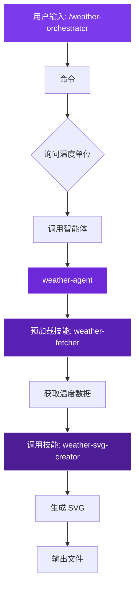

# 💻 实现示例

可运行的示例代码和完整工作流实现，即学即用。

## 🎯 示例概览

本节提供 **5 个完整的实现示例**，涵盖 Claude Code 的核心功能。

---

## 📂 实现列表

### 🤖 [子智能体实现](./claude-subagents-implementation.md)

**实现内容**:
- `weather-agent` - 天气数据处理智能体
- `time-agent` - 时间显示智能体  
- `presentation-curator` - 演示文稿管理智能体
- `development-workflows-research-agent` - 工作流研究智能体

**包含**:
- ✅ 完整的 YAML frontmatter 配置
- ✅ 智能体能力说明
- ✅ 预加载技能配置
- ✅ 钩子集成示例

[查看实现 →](./claude-subagents-implementation.md)

---

### 📝 [命令实现](./claude-commands-implementation.md)

**实现内容**:
- `/weather-orchestrator` - 天气工作流编排命令
- `/time-command` - 时间显示命令
- 工作流命令系列

**包含**:
- ✅ 命令结构设计
- ✅ 工作流编排模式
- ✅ 用户交互（AskUserQuestion）
- ✅ 智能体和技能调用

[查看实现 →](./claude-commands-implementation.md)

---

### 🎯 [技能实现](./claude-skills-implementation.md)

**实现内容**:
- `weather-fetcher` - 智能体技能模式
- `weather-svg-creator` - 技能模式
- `time-skill` - 简单技能示例

**包含**:
- ✅ SKILL.md 结构
- ✅ 渐进式展示（references/、examples/）
- ✅ 两种技能模式对比
- ✅ YAML 配置详解

[查看实现 →](./claude-skills-implementation.md)

---

### ⏰ [定时任务实现](./claude-scheduled-tasks-implementation.md)

**实现内容**:
- 本地循环任务（/loop）
- 云端定时任务（/schedule）
- cron 工具集成

**包含**:
- ✅ /loop 配置和使用
- ✅ /schedule 云端执行
- ✅ 监控和日志
- ✅ 错误处理和重试

[查看实现 →](./claude-scheduled-tasks-implementation.md)

---

### 👥 [智能体团队实现](./claude-agent-teams-implementation.md)

**实现内容**:
- tmux 多窗格配置
- Git 工作树隔离
- 并行智能体协作

**包含**:
- ✅ 团队配置设置
- ✅ 任务分配策略
- ✅ 同步和协调机制
- ✅ 完整示例演示

[查看实现 →](./claude-agent-teams-implementation.md)

---

## 🚀 如何使用这些示例

### 步骤 1: 阅读代码

每个示例都包含：
- 📝 完整的配置文件
- 🎯 实现说明
- 💡 关键要点
- ⚠️ 注意事项

### 步骤 2: 复制到项目

```bash
# 复制智能体定义
cp claude-code-best-practice/.claude/agents/weather-agent.md \
   your-project/.claude/agents/

# 复制命令
cp claude-code-best-practice/.claude/commands/weather-orchestrator.md \
   your-project/.claude/commands/

# 复制技能
cp -r claude-code-best-practice/.claude/skills/weather-fetcher \
      your-project/.claude/skills/
```

### 步骤 3: 根据需求修改

根据你的项目需求调整：
- 修改智能体的能力描述
- 调整命令的工作流逻辑
- 定制技能的内容和触发条件

### 步骤 4: 测试和迭代

```bash
# 启动 Claude Code
claude

# 测试命令
/your-command

# 验证输出
ls output/
```

## 💡 学习建议

### 按难度学习

**入门** ⭐
1. [命令实现](./claude-commands-implementation.md) - 最简单，先从这里开始
2. [技能实现](./claude-skills-implementation.md) - 理解渐进式展示

**进阶** ⭐⭐
1. [子智能体实现](./claude-subagents-implementation.md) - 隔离上下文
2. [定时任务实现](./claude-scheduled-tasks-implementation.md) - 自动化

**高级** ⭐⭐⭐
1. [智能体团队实现](./claude-agent-teams-implementation.md) - 并行协作

### 按场景学习

**自动化日常任务**
→ [命令实现](./claude-commands-implementation.md)

**知识沉淀和复用**
→ [技能实现](./claude-skills-implementation.md)

**功能特定的复杂任务**
→ [子智能体实现](./claude-subagents-implementation.md)

**持续监控和执行**
→ [定时任务实现](./claude-scheduled-tasks-implementation.md)

**大型项目并行开发**
→ [智能体团队实现](./claude-agent-teams-implementation.md)

## 🎨 架构图示

### 编排工作流架构



## 📚 相关资源

- 📖 [最佳实践](/best-practice/) - 理论指导
- 💡 [技巧集锦](/tips/) - 实战技巧
- 🔧 [工作流对比](/workflows/comparison) - 选择合适的方案

---

**推荐**: 从 [命令实现](./claude-commands-implementation.md) 开始，这是最简单且最实用的入门示例。

<style scoped>
table {
  font-size: 0.95rem;
}

table td:first-child {
  font-weight: 600;
}
</style>
