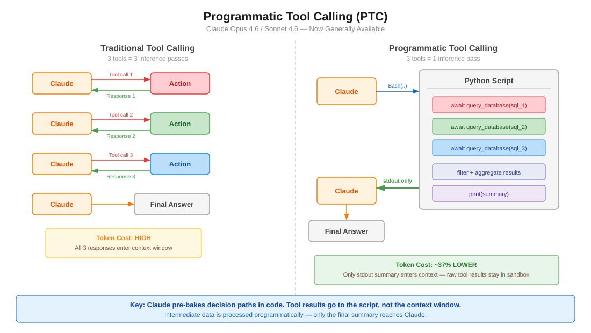

# Claude 高级工具使用模式

API 级别的功能(现已正式发布)可减少令牌消耗、延迟并提高工具准确性。随 Opus/Sonnet 4.6 一起发布。

<table width="100%">
<tr>
<td><a href="../">← Back to Claude Code Best Practice</a></td>
<td align="right"></td>
</tr>
</table>

## 目录

1. [概述](#overview)
2. [编程式工具调用(PTC)](#programmatic-tool-calling-ptc)
3. [网页搜索/获取的动态过滤](#dynamic-filtering-for-web-searchfetch)
4. [工具搜索工具](#tool-search-tool)
5. [工具使用示例](#tool-use-examples)
6. [与 Claude Code 的相关性](#claude-code-relevance)

---

## 概述

| 功能 | 解决的问题 | 令牌节省 | 可用性 |
|---------|---------------|---------------|--------------|
| 编程式工具调用 | 多步骤代理循环在往返中消耗令牌 | 减少约37% | API, Foundry (正式版) |
| 动态过滤 | 网页搜索/获取结果用无关内容填充上下文 | 输入令牌减少约24% | API, Foundry (正式版) |
| 工具搜索工具 | 过多的工具定义填充上下文 | 减少约85% | API, Foundry (正式版) |
| 工具使用示例 | 仅靠架构无法表达使用模式 | 准确率从72%提升到90% | API, Foundry (正式版) |

所有功能自2026年2月18日起**正式可用**。

**策略性分层** — 从最大瓶颈开始:
- 工具定义导致的上下文膨胀 → 工具搜索工具
- 大型中间结果 → 编程式工具调用
- 网页搜索噪音 → 动态过滤
- 参数错误 → 工具使用示例

---

## 编程式工具调用(PTC)



### 范式转变

**之前(传统工具调用):**
```
用户提示 → Claude → 工具调用1 → 响应1 → Claude → 工具调用2 → 响应2 → Claude → 工具调用3 → 响应3 → Claude → 最终答案
```
每次工具调用都需要完整的模型往返。3个工具 = 3次推理。

**之后(编程式工具调用):**
```
用户提示 → Claude → 编写Python脚本 → 脚本内部调用工具1、2、3 → stdout → Claude → 最终答案
```
Claude 编写代码来协调所有工具。只有最终的 `stdout` 进入上下文窗口。3个工具 = 1次推理。

### 工作原理

1. 使用 `allowed_callers: ["code_execution_20250825"]` 定义工具
2. Claude 编写 Python 代码,在沙箱内以异步函数方式调用这些工具
3. 当调用工具函数时,沙箱暂停,API 返回一个 `tool_use` 块
4. 你提供工具结果 — 它进入**运行中的代码**,而不是 Claude 的上下文
5. 代码恢复,处理结果,根据需要调用更多工具
6. 只有最终执行的 `stdout` 到达 Claude

### Key Configuration

```json
{
  "tools": [
    {
      "type": "code_execution_20250825",
      "name": "code_execution"
    },
    {
      "name": "query_database",
      "description": "Execute a SQL query. Returns rows as JSON objects with fields: id (str), name (str), revenue (float).",
      "input_schema": {
        "type": "object",
        "properties": {
          "sql": { "type": "string", "description": "SQL query to execute" }
        },
        "required": ["sql"]
      },
      "allowed_callers": ["code_execution_20250825"]
    }
  ]
}
```

### `allowed_callers` 字段

| 值 | 行为 |
|-------|----------|
| `["direct"]` | 仅传统工具调用(省略时的默认值) |
| `["code_execution_20250825"]` | 仅可从 Python 沙箱调用 |
| `["direct", "code_execution_20250825"]` | 两种模式都可用 |

**建议:** 每个工具只选择一种模式,不要两者都选。这能给 Claude 更清晰的指导。

### 响应中的 `caller` 字段

每个工具使用块都包含一个 `caller` 字段,让你知道它是如何被调用的:

```json
// Direct (traditional)
{ "caller": { "type": "direct" } }

// Programmatic (from code execution)
{ "caller": { "type": "code_execution_20250825", "tool_id": "srvtoolu_abc123" } }
```

### 高级模式

**批处理** — 在1次推理中处理N个项目:
```python
regions = ["West", "East", "Central", "North", "South"]
results = {}
for region in regions:
    data = await query_database(f"SELECT SUM(revenue) FROM sales WHERE region='{region}'")
    results[region] = data[0]["revenue"]

top = max(results.items(), key=lambda x: x[1])
print(f"Top region: {top[0]} with ${top[1]:,}")
```

**提前终止** — 一旦满足成功标准就停止:
```python
endpoints = ["us-east", "eu-west", "apac"]
for endpoint in endpoints:
    status = await check_health(endpoint)
    if status == "healthy":
        print(f"Found healthy endpoint: {endpoint}")
        break
```

**条件工具选择:**
```python
file_info = await get_file_info(path)
if file_info["size"] < 10000:
    content = await read_full_file(path)
else:
    content = await read_file_summary(path)
print(content)
```

**数据过滤** — 减少 Claude 看到的内容:
```python
logs = await fetch_logs(server_id)
errors = [log for log in logs if "ERROR" in log]
print(f"Found {len(errors)} errors")
for error in errors[-10:]:
    print(error)
```

### 模型兼容性

| 模型 | 是否支持 |
|-------|-----------|
| Claude Opus 4.6 | 是 |
| Claude Sonnet 4.6 | 是 |
| Claude Sonnet 4.5 | 是 |
| Claude Opus 4.5 | 是 |

### 限制

| 限制 | 详情 |
|-----------|--------|
| **不支持 Bedrock/Vertex** | 仅 API 和 Foundry |
| **不支持 MCP 工具** | MCP 连接器工具无法通过编程方式调用 |
| **不支持网页搜索/获取** | PTC 不支持网页工具 |
| **不支持结构化输出** | `strict: true` 工具不兼容 |
| **无法强制工具选择** | `tool_choice` 无法强制 PTC |
| **容器生命周期** | 约4.5分钟后过期 |
| **ZDR** | 不在零数据保留覆盖范围内 |
| **工具结果为字符串** | 验证外部结果以防代码注入风险 |

### 何时使用 PTC

| 适用场景 | 不太理想的场景 |
|----------------|------------|
| 处理需要聚合的大型数据集 | 简单响应的单个工具调用 |
| 顺序执行3个以上相关工具调用 | 需要即时用户反馈的工具 |
| 在 Claude 看到结果之前过滤/转换结果 | 非常快速的操作(开销 > 收益) |
| 跨多个项目的并行操作 | |
| 基于中间结果的条件逻辑 | |

### 令牌效率

- 编程调用的工具结果**不会添加到 Claude 的上下文中** — 只有最终的 `stdout`
- 中间处理发生在代码中,而不是模型令牌中
- 编程方式调用10个工具 ≈ 直接调用10个工具令牌数的1/10

---

## 网页搜索/获取的动态过滤

### 问题

网页搜索和获取工具将完整的 HTML 页面导入 Claude 的上下文窗口。大部分内容都是无关的 — 导航、广告、样板内容。然后 Claude 对所有内容进行推理,浪费令牌并降低准确性。

### 解决方案

Claude 现在**编写并执行 Python 代码来过滤网页结果**,然后再进入上下文窗口。Claude 不是对原始 HTML 进行推理,而是在沙箱中过滤、解析并仅提取相关内容。

### 工作原理

**之前:**
```
查询 → 搜索结果 → 获取完整 HTML × N 页 → 所有内容进入上下文 → Claude 对一切进行推理
```

**之后:**
```
查询 → 搜索结果 → Claude 编写过滤代码 → 代码仅提取相关内容 → 过滤后的结果进入上下文
```

### API 配置

使用带 beta 头部的更新工具类型版本:

```json
{
  "model": "claude-opus-4-6",
  "max_tokens": 4096,
  "tools": [
    {
      "type": "web_search_20260209",
      "name": "web_search"
    },
    {
      "type": "web_fetch_20260209",
      "name": "web_fetch"
    }
  ]
}
```

**必需的头部:** `anthropic-beta: code-execution-web-tools-2026-02-09`

使用 Sonnet 4.6 和 Opus 4.6 的新工具类型版本时**默认启用**。

### 基准测试结果

**BrowseComp**(在网站上查找特定信息):

| 模型 | 无过滤 | 有过滤 | 改进 |
|-------|-------------------|----------------|-------------|
| Sonnet 4.6 | 33.3% | **46.6%** | +13.3 pp |
| Opus 4.6 | 45.3% | **61.6%** | +16.3 pp |

**DeepsearchQA**(多步骤研究,F1分数):

| 模型 | 无过滤 | 有过滤 | 改进 |
|-------|-------------------|----------------|-------------|
| Sonnet 4.6 | 52.6% | **59.4%** | +6.8 pp |
| Opus 4.6 | 69.8% | **77.3%** | +7.5 pp |

**令牌效率:** 平均减少24%的输入令牌。Sonnet 4.6 可看到成本降低;Opus 4.6 由于更复杂的过滤代码可能会略微增加。

### 使用场景

- 筛选技术文档
- 验证多个来源的引用
- 交叉引用搜索结果
- 多步骤研究查询
- 查找埋藏在大型页面中的特定数据点

---

## 工具搜索工具

### 问题

预先加载所有工具定义会浪费上下文。如果你有50个 MCP 工具,每个约1.5K令牌,那么在用户提问之前就已经使用了75K令牌。

### 解决方案

使用 `defer_loading: true` 标记不常用的工具。它们会从初始上下文中排除。Claude 通过工具搜索工具按需发现它们。

### Configuration

```json
{
  "tools": [
    {
      "type": "mcp_toolset",
      "mcp_server_name": "google-drive",
      "default_config": { "defer_loading": true },
      "configs": {
        "search_files": { "defer_loading": false }
      }
    }
  ]
}
```

### 最佳实践

- 始终加载3-5个最常用的工具,延迟加载其余工具
- 编写清晰、描述性的工具名称和描述(搜索依赖于它们)
- 在系统提示中记录可用功能

### 何时使用

- 工具定义消耗 > 10K 令牌
- 可用工具超过10个
- 多个 MCP 服务器
- 由于选项过多导致的工具选择准确性问题

### 令牌节省

工具定义令牌减少约85%(在 Anthropic 的基准测试中从77K降至8.7K)。

### Claude Code 等效功能

Claude Code 有 **MCP 工具搜索自动模式**(自 v2.1.7 起默认启用)。当 MCP 工具描述超过上下文的10%时,它们会被延迟并通过 `MCPSearch` 发现。使用 `ENABLE_TOOL_SEARCH=auto:N` 配置阈值,其中 N 是上下文百分比(0-100)。

---

## 工具使用示例

### 问题

JSON 架构定义了结构,但无法表达:
- 何时包含可选参数
- 哪些参数组合有意义
- 格式约定(日期格式、ID模式)
- 嵌套结构用法

### 解决方案

在工具定义中添加 `input_examples` — 超越架构的具体使用模式。

### Configuration

```json
{
  "name": "create_ticket",
  "description": "Create a support ticket",
  "input_schema": {
    "type": "object",
    "properties": {
      "title": { "type": "string" },
      "priority": { "type": "string", "enum": ["low", "medium", "high", "critical"] },
      "assignee": { "type": "string" },
      "labels": { "type": "array", "items": { "type": "string" } }
    },
    "required": ["title"]
  },
  "input_examples": [
    {
      "title": "Login page returns 500 error",
      "priority": "critical",
      "assignee": "oncall-team",
      "labels": ["bug", "auth", "production"]
    },
    {
      "title": "Add dark mode support",
      "priority": "low",
      "labels": ["feature-request", "ui"]
    },
    {
      "title": "Update API docs for v2 endpoints"
    }
  ]
}
```

### 最佳实践

- 使用**真实数据**,而不是"example_value"之类的占位符字符串
- 展示**多样性**:最小、部分和完整规范
- 保持简洁:**每个工具1-5个示例**
- 专注于解决歧义 — 以行为清晰度为目标,而非架构完整性
- 展示参数相关性(例如,`priority: "critical"` 往往有 `assignee`)

### 结果

在 Anthropic 的基准测试中,复杂参数处理的准确率从72%提升到90%。

---

## 与 Claude Code 的相关性

### 直接适用于 Claude Code 用户的内容

| 功能 | Claude Code 状态 | 操作 |
|---------|-------------------|--------|
| 工具搜索 | 自 v2.1.7 起作为 MCPSearch 自动模式内置 | 如果有很多 MCP 工具,调整 `ENABLE_TOOL_SEARCH=auto:N` |
| 动态过滤 | CLI 中不可用(API级网页工具) | 对进行网页研究的 Agent SDK 用户有用 |
| PTC | CLI 中不可用 | 对构建自定义代理的 Agent SDK 用户有用 |
| 工具使用示例 | CLI 中不可配置 | 对自定义 MCP 服务器作者有用 |

### 对于 Agent SDK 开发者

如果你使用 `@anthropic-ai/claude-agent-sdk` 构建代理,PTC 可以立即使用:

1. 将 `code_execution_20250825` 添加到工具数组
2. 在受益于批处理/过滤的工具上设置 `allowed_callers`
3. 实现工具结果循环(暂停 → 提供结果 → 恢复)
4. 从工具返回结构化数据(JSON)以便更容易地进行编程解析

### 对于 MCP 服务器作者

如果你正在构建自定义 MCP 服务器,工具使用示例可以改善 Claude 使用工具的方式:
- 在工具架构中添加 `input_examples`
- 在描述中清楚地记录返回格式(PTC 需要解析它们)

---

## 资料来源

- [Anthropic Engineering: Advanced Tool Use](https://www.anthropic.com/engineering/advanced-tool-use)
- [Programmatic Tool Calling Documentation](https://platform.claude.com/docs/en/agents-and-tools/tool-use/programmatic-tool-calling)
- [Code Execution Tool Documentation](https://platform.claude.com/docs/en/agents-and-tools/tool-use/code-execution-tool)
- [Improved Web Search with Dynamic Filtering](https://claude.com/blog/improved-web-search-with-dynamic-filtering)
