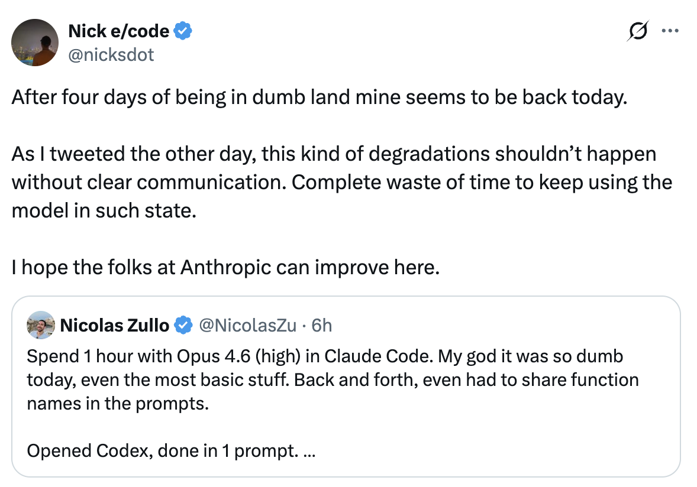
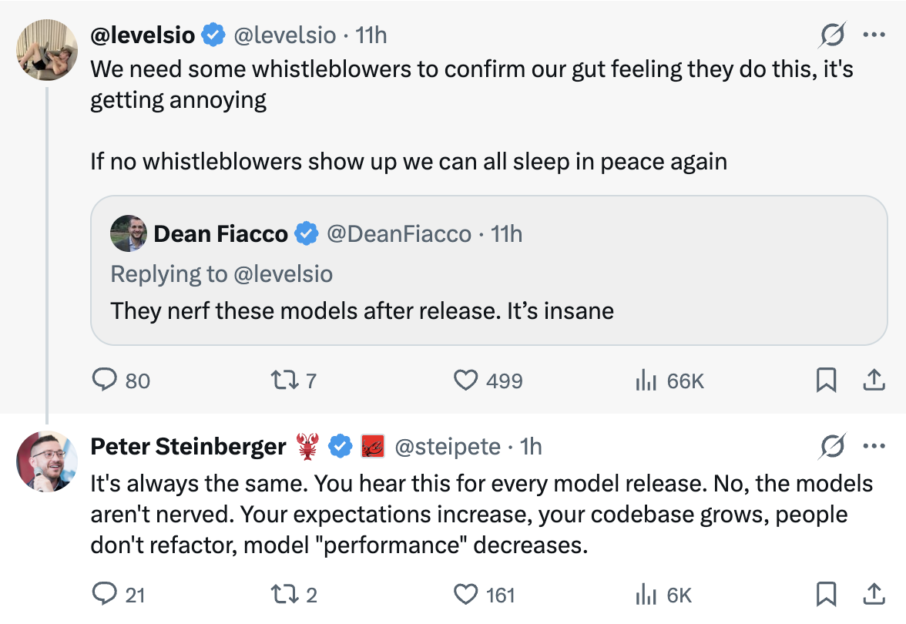

# LLM 日常性能下降:神话 vs 现实

即使模型权重被冻结,已部署的 LLM 的性能会日复一日地变化吗?深入探讨已证实的原因、基础设施错误和心理因素。

<table width="100%">
<tr>
<td><a href="../">← Back to Claude Code Best Practice</a></td>
<td align="right"></td>
</tr>
</table>

---

<table width="100%">
<tr>
<td width="50%"><a href="https://x.com/nicksdot/status/2029520949176049704"></a></td>
<td width="50%"><a href="https://x.com/levelsio/status/2029369159893569680"></a></td>
</tr>
</table>

---
---

# 🔥 Claude Code Ops 4.6 分析。高度推理

当 Anthropic 推出像 Opus 4.6 这样的模型时,**模型权重** — 数十亿个学习参数 — 被冻结。训练费用极其昂贵(数百万美元,数周的计算)。没有人会在一夜之间重新训练模型。

但权重只是一个更大系统的一层。研究揭示了至少**7种不同的机制**,即使模型权重被冻结,也可能导致真实或感知的质量变化。

| 问题 | 答案 |
|----------|--------|
| 模型权重在发布后会改变吗? | **否** — 所有提供商确认 |
| 模型可以日复一日地表现不同吗? | **是** — 已证明有±8-14%的变化 |
| 这是故意的"削弱"吗? | **否** — 没有证据表明故意降级 |
| 基础设施错误是真实的吗? | **是** — Anthropic 确认了3个影响多达16%请求的错误 |
| 其中一些是心理作用吗? | **是** — 确认偏差和蜜月效应是真实的 |
| 系统提示/后训练可以改变吗? | **是** — 各提供商都有记录 |
| 用户应该相信他们的感知吗? | **部分** — 真实原因存在,但感知放大了它们 |

---

## 完整的推理堆栈

模型权重被冻结,但**其上的九层**可以独立影响你的体验:

```
┌──────────────────────────────────────────────┐
│  YOUR SESSION CONTEXT                        │  ← Degrades within session
│  (accumulated errors, long conversations)    │
├──────────────────────────────────────────────┤
│  SYSTEM PROMPT                               │  ← Updated regularly
│  (safety rules, behavior instructions)       │
├──────────────────────────────────────────────┤
│  POST-TRAINING (RLHF / Fine-tuning)         │  ← Can be updated quietly
│  (instruction following, safety alignment)   │
├──────────────────────────────────────────────┤
│  SAMPLING PARAMETERS                         │  ← Can be tuned server-side
│  (temperature, top-p, top-k)                 │
├──────────────────────────────────────────────┤
│  SPECULATIVE DECODING                        │  ← Draft model quality varies
│  (draft model predictions + verification)    │
├──────────────────────────────────────────────┤
│  MoE ROUTING / BATCH COMPOSITION             │  ← ±8-14% variance proven
│  (which experts activate per request)        │
├──────────────────────────────────────────────┤
│  HARDWARE ROUTING                            │  ← TPU vs GPU vs Trainium
│  (which cluster serves your request)         │
├──────────────────────────────────────────────┤
│  QUANTIZATION LEVEL                          │  ← May vary under load
│  (FP16 vs INT8 vs INT4 precision)            │
├──────────────────────────────────────────────┤
│  COMPILER & RUNTIME                          │  ← XLA bugs proven real
│  (XLA:TPU, CUDA, hardware-specific code)     │
├──────────────────────────────────────────────┤
│  MODEL WEIGHTS (FROZEN)                      │  ← These DON'T change
│  (billions of learned parameters)            │
└──────────────────────────────────────────────┘
```

The key mental model: **frozen weights ≠ frozen behavior**. This is like saying "same engine = same driving experience" while ignoring the tires, road conditions, fuel quality, and driver fatigue.

---

## Proven Causes: Infrastructure Bugs

### Anthropic's September 2025 Postmortem

In September 2025, Anthropic published a detailed postmortem revealing **three separate infrastructure bugs** that degraded Claude's quality between August and September 2025. Their official statement:

> "We never reduce model quality due to demand, time of day, or server load. The problems our users reported were due to infrastructure bugs alone."

### Bug #1 — Context Window Routing Error

Sonnet 4 requests were accidentally routed to servers configured for 1M token context windows instead of standard servers.

- **Timeline**: Introduced August 5, worsened August 29 after a load balancing change
- **Peak impact**: 16% of Sonnet 4 requests affected at worst hour (August 31)
- **User impact**: ~30% of Claude Code users had at least one degraded message
- **Insidious detail**: Routing was "sticky" — once you hit a bad server, subsequent requests kept going there
- **Fixed**: September 4–18 (rolled out across platforms)

### Bug #2 — TPU Output Corruption

A misconfiguration on TPU servers caused errors during token generation, assigning high probability to tokens that should rarely appear.

- **Symptoms**: Thai or Chinese characters appearing mid-English response, obvious code syntax errors
- **Affected**: Opus 4.1 and Opus 4 (August 25–28), Sonnet 4 (August 25–September 2)
- **Scope**: Only Claude API; third-party platforms unaffected
- **Fixed**: Rolled back September 2

### Bug #3 — XLA:TPU Compiler Miscompilation (the nastiest)

A code change to fix precision issues accidentally exposed a **latent compiler bug** in Google's XLA:TPU.

- **Root cause**: The approximate top-k operation (used to pick the most likely next tokens) "sometimes returned completely wrong results, but only for certain batch sizes and model configurations"
- **Why it was hard to find**: It changed behavior depending on what operations ran before or after it, and whether debugging tools were enabled
- **Hidden for months**: A previous workaround from December 2024 had been accidentally masking this deeper bug
- **Affected**: Haiku 3.5 confirmed; subset of Sonnet 4 and Opus 3 suspected
- **Resolution**: Switched from approximate to exact top-k; accepted "minor efficiency impact" because "Model quality is non-negotiable"

### Why Detection Was Difficult

Anthropic's own automated evaluations didn't catch the degradation users reported, "in part because Claude often recovers well from isolated mistakes." Each bug produced different symptoms on different platforms at different rates, creating "a confusing mix of reports that didn't point to any single cause."

Key context: Claude runs on **three different hardware platforms** (AWS Trainium, NVIDIA GPUs, Google TPUs), each with different failure modes, compilers, and precision behaviors. Your request might hit different hardware on different days.

---

## Proven Causes: MoE Routing Variance

Modern large models often use a **Mixture-of-Experts (MoE)** architecture, where only a subset of the model's parameters ("experts") activate for each input. A learned router decides which experts to use.

Scale AI's research revealed a critical finding:

> "The combination of Sparse MoE and batched inference creates unpredictable results because the composition of a batch can determine which expert your query gets routed to, and the mix of queries from other users in the same batch is not deterministic."

### Measured Day-to-Day Variance Across Providers

| Provider | Day-to-Day Score Variance |
|----------|--------------------------|
| OpenAI (GPT-4 variants) | ±10–12% |
| Anthropic (Claude variants) | ±8–11% |
| Google (Gemini variants) | ±9–14% |

Concrete example: the same model scored **77% on jailbreak resistance one day and 63% the next**. Same model, same weights, same test — 14 percentage points of swing from infrastructure alone.

This means even with zero bugs and zero changes, the same model can produce noticeably different quality outputs on different days purely due to how requests are batched and routed. An A/B test cannot reliably detect a 5% quality signal when the day-to-day noise is 10–15%.

---

## Proven Causes: System Prompt & Post-Training Updates

### System Prompt Changes

The model weights don't change, but the **system prompt** wrapping those weights can be updated at any time. Analysis of Claude's system prompt evolution shows dozens of iterations, with "hot-fixes" — short instructions added to patch undesired behavior — being added and removed regularly.

Claude 3.7's system prompt contained multiple hot-fix instructions targeting common LLM "gotchas." Claude 4.0's system prompt removed all of them, with the behaviors addressed during post-training through reinforcement learning instead.

### The Post-Training Theory

The most plausible theory for unexplained quality shifts: companies can update **fine-tuning and RLHF** (reinforcement learning from human feedback) without changing the base model weights. This would technically make it truthful to say "the model hasn't changed" while still altering behavior through updated safety guardrails and instruction-following adjustments.

---

## Proven Causes: Silent Model Swaps

OpenAI has been documented multiple times silently changing which model users interact with:

- Removing the model picker overnight, forcing users from GPT-4o to GPT-5
- Making GPT-4o a hidden "legacy model" requiring a manual toggle in settings, with no in-app notification
- An "autoswitcher" bug routing users to wrong models
- Plus subscribers reported models switching to a "restricted version" without consent

Sam Altman acknowledged the rollout was "a little more bumpy than we hoped for." Reddit threads received thousands of upvotes calling the new model a "disaster" and a "downgrade."

This demonstrates that model swaps **do happen** in the industry — sometimes intentionally (product decisions) and sometimes accidentally (routing bugs).

---

## Contributing Factors

### Quantization Under Load

To serve millions of users cost-effectively, companies may serve **quantized** versions of models — reducing precision from FP16 to INT8 or INT4. This can reduce memory usage by 2–4x and accelerate inference, but introduces subtle quality loss. Whether providers dynamically switch quantization levels under load is debated, but the technical capability exists and is well-documented in serving frameworks like vLLM and TensorRT.

### Speculative Decoding

Modern serving stacks use a smaller "draft" model to predict multiple tokens ahead, then have the real model verify them. Theoretically this preserves the same output distribution, but in practice acceptance rates vary by domain and context. Out-of-the-box draft models may work fine in some cases but often struggle with domain-specific tasks or very long contexts.

### Context Window Pollution

In a long coding session, earlier mistakes accumulate in context. The model sees its own errors and may perpetuate them. This is the most common cause of "Claude got dumber" within a single session — it's not the model degrading, it's context contamination.

**Practical tip**: Use `/compact` or start fresh sessions when quality feels off. This is the single most actionable thing you can do.

---

## The Stanford Study — And Why It's Complicated

The landmark 2023 study by Stanford and UC Berkeley (Chen, Zaharia, Zou) — "How is ChatGPT's Behavior Changing Over Time?" — is frequently cited as proof that LLMs degrade. The headline finding:

> GPT-4's accuracy on "Is this number prime? Think step by step" fell from **97.6% to 2.4%** between March and June 2023.

### What the Study Proved

- The behavior of the "same" LLM service **can change substantially** in a short period
- Different capabilities can move in opposite directions (GPT-4 got worse at math, GPT-3.5 got better)
- Code generation quality dropped (GPT-4 executable code: 52% → 10%)
- The study coined the term **"LLM drift"**

### Methodological Critiques

- The March version used **temperature 0.0** while the June version used **temperature 1.0** — a fundamental confounding variable that increases randomness
- Only **500 queries per task** — too small for definitive statistical claims
- The "math questions" were actually yes/no questions where the model's guessing pattern changed, not its mathematical ability
- Changes likely reflected intentional **post-training safety updates**, not degradation

The study proved something important — LLM behavior changes over time — but the mechanism was likely intentional updates, not unintentional degradation.

---

## The Psychology

### Confirmation Bias

Once someone tweets "Claude is dumb today," you start noticing every mistake. On days when nobody complains, you brush off the same errors. Social media amplifies this effect.

### The Honeymoon Effect

Users experience an initial honeymoon period with new models, then gradually discover limitations. The model didn't change — expectations adjusted upward faster than capabilities warranted.

### Task Difficulty Variance

Your tasks vary day to day. A day of hard problems feels like the model got worse, even when it hasn't.

### The "Weekend Claude" Myth

Despite many users believing in day-of-week patterns, rigorous analysis found **no consistent evidence** for day-of-week quality patterns. One analysis titled "AI is Dumber on Mondays" came up empty.

### Stochastic Nature of LLMs

LLMs are probabilistic. The same prompt can produce different outputs each time. On a bad luck streak, you might get several poor responses in a row — pure randomness, not degradation.

---

## 底线

用户描述的现象是**真实的但归因错误**:

- **正确**: 他们的体验在某些天退化了
- **不正确**: 模型被故意"削弱"了

实际原因是以下因素的组合:

1. **基础设施错误** — 由 Anthropic 的事后分析证明(多达16%的请求受影响)
2. **MoE 路由变化** — Scale AI 测量的±8-14%质量波动,即使零变化
3. **系统提示和后训练更新** — 各提供商都有记录
4. **硬件异构性** — TPU vs GPU vs Trainium,每个都有不同的失败模式
5. **上下文污染** — 长会话降低会话内质量
6. **确认偏差** — 社交媒体放大了感知模式
7. **随机变化** — 相同模型,相同提示,每次不同输出

测量问题很严重:±8-14%的日常变化意味着你无法从噪音中区分出真实的5%质量变化。这就是为什么"都在你脑中"和"他们削弱了它"两个阵营都感到自信 — 信噪比使得仅从个人经验无法判断。

---

## 资料来源

- [Anthropic: A Postmortem of Three Recent Issues](https://www.anthropic.com/engineering/a-postmortem-of-three-recent-issues) — 详述三个基础设施错误的官方事后分析(2025年9月)
- [Anthropic Reveals Three Infrastructure Bugs — InfoQ](https://www.infoq.com/news/2025/10/anthropic-infrastructure-bugs/) — 事后分析的技术分析
- [How is ChatGPT's Behavior Changing Over Time? — Stanford/UC Berkeley](https://arxiv.org/abs/2307.09009) — LLM 漂移的里程碑研究(2023)
- [The Truth About ChatGPT's Degrading Capabilities — TechTalks](https://bdtechtalks.com/2023/07/24/chatgpt-capabilities-degrading-study/) — 对斯坦福研究的方法学批评
- [LLMs Are Getting Dumber and We Have No Idea Why — Ignorance.ai](https://www.ignorance.ai/p/llms-are-getting-dumber-and-we-have) — 感知退化的五种理论
- [When Claude Forgets How to Code — Robert Matsuoka](https://hyperdev.matsuoka.com/p/when-claude-forgets-how-to-code) — Claude 质量波动和基础设施原因分析
- [Smoothing Out LLM Variance — Scale AI](https://scale.com/blog/smoothing-out-llm-variance) — 测量各提供商的±8-14%日常变化
- [What We Can Learn from Anthropic's System Prompt Updates — PromptLayer](https://blog.promptlayer.com/what-we-can-learn-from-anthropics-system-prompt-updates/) — 系统提示演变分析
- [Claude's System Prompt Changes Reveal Anthropic's Priorities — Drew Breunig](https://www.dbreunig.com/2025/06/03/comparing-system-prompts-across-claude-versions.html) — 系统提示中的热修复模式
- [Complaints About Secretly Switching Models — OpenAI Forum](https://community.openai.com/t/complaints-about-secretly-switching-models/1360150) — 记录的静默模型切换
- [Speculative Decoding — BentoML LLM Inference Handbook](https://bentoml.com/llm/inference-optimization/speculative-decoding) — 草稿模型如何影响服务
- [A Visual Guide to Mixture of Experts — Maarten Grootendorst](https://newsletter.maartengrootendorst.com/p/a-visual-guide-to-mixture-of-experts) — MoE 架构和路由解释

---
---

# 🔥 Codex 5.3 高度推理和发现

### 报告范围

本节解释为什么用户可能会经历一个短暂的窗口期,在此期间 Claude 输出质量下降,而 Codex 5.3 在编码任务上感觉稳定或更强。重点不是永久的模型质量排名。重点是真实服务条件下的短期生产行为。

报告日期:2026年3月5日。

### Observed Pattern

The reported pattern is:

1. Model quality is acceptable for a period.
2. Quality appears to degrade for several days.
3. Quality returns close to prior baseline.

This shape is usually a serving-stack or rollout pattern, not a permanent base-model capability change. Permanent capability decline would not normally recover this quickly without an explicit rollback or fix.

### High Reason: Why Codex 5.3 Can Look Better in a Bad Window

Codex 5.3 can appear clearly stronger during another provider's degraded period for several technical reasons that can all happen at the same time:

1. Product-objective fit. Codex 5.3 is optimized for code-generation and agentic coding workflows, so even equal raw model strength can yield better coding outcomes due to tool orchestration, repository reasoning, and code-centric instruction tuning.
2. Inference policy differences. Providers tune latency, reasoning depth, and decoding defaults independently. A more conservative policy at one provider can look "smarter" than an aggressive speed-optimized policy at another for the same day.
3. Serving-path separation. Even if two providers host state-of-the-art models, they run different routing layers, compiler/runtime stacks, and rollout pipelines. An incident in one stack does not imply correlated degradation in the other.
4. Rollout and rollback timing. If one provider is mid-rollout while another is stable, users can see large temporary quality divergence with no underlying long-term change in model weights.
5. Session-level contamination effects. In long coding chats, error accumulation can amplify perceived decline. A competing assistant can feel better simply because the failing session was reset or because its tool loop recovered faster.

### Detailed Finding

For a report like "Claude felt very weak for about four days, then came back," the most probable explanation is:

1. A provider-side incident, routing issue, decoding/runtime bug, or rollout regression affected a subset of requests.
2. The issue persisted long enough to be noticed repeatedly in real workflows.
3. The issue was fixed or rolled back.
4. Perceived quality returned quickly.

During that same period, Codex 5.3 could feel substantially better because it did not share the same incident path and because coding-task optimization magnified the gap in practical outcomes.

### Hypothesis Ranking for This Pattern

| Hypothesis | Likelihood | Rationale |
|------------|------------|-----------|
| Provider incident plus rollback | High | Best match for multi-day dip followed by fast recovery |
| Serving configuration change (sampling/latency/reasoning budget) | High | Common source of sudden behavior shifts without model retraining |
| Silent alias or snapshot movement | Medium-High | Can change behavior with no visible user action |
| Prompt drift and context contamination only | Medium | Can degrade sessions, but less likely to explain broad multi-day reports alone |
| Permanent base-model degradation | Low | Inconsistent with fast return to previous quality |

### What Would Confirm or Falsify This Finding

To turn this from high-confidence inference into hard proof, collect request-level telemetry for the same task set across days:

1. Exact model identifier and snapshot/alias at request time.
2. Any backend fingerprint or release marker exposed by the provider.
3. Decoding parameters (temperature, top_p, top_k, max tokens).
4. Latency, timeout, and error-rate traces.
5. Structured quality scores on a fixed coding benchmark prompt set.
6. Session length and token-context depth at failure points.

If quality drops correlate with an incident window, a config change, or a backend fingerprint shift, the incident/config hypothesis is confirmed. If no such shifts exist and degradation is only in long sessions, context contamination becomes the primary explanation.

### Practical Engineering Guidance

To reduce day-to-day variance in production:

1. Pin model snapshots when available instead of using floating aliases.
2. Store request metadata (model ID, parameters, latency, errors, response quality label).
3. Run a fixed daily canary suite for coding tasks and alert on regression.
4. Reset or compact long-running sessions after several failed turns.
5. Keep a fallback provider/model path for incident windows.
6. Separate "model quality" from "serving reliability" in internal dashboards.

### 最终结论

在短暂的 Claude 退化窗口期间 Codex 5.3 看起来更好,在现代 LLM 操作中是技术上合理且预期的结果。最有力的解释不是永久性模型崩溃。最有力的解释是一个提供商的临时服务路径退化,加上另一个提供商在同一时期的编码特定优化和稳定运行。
