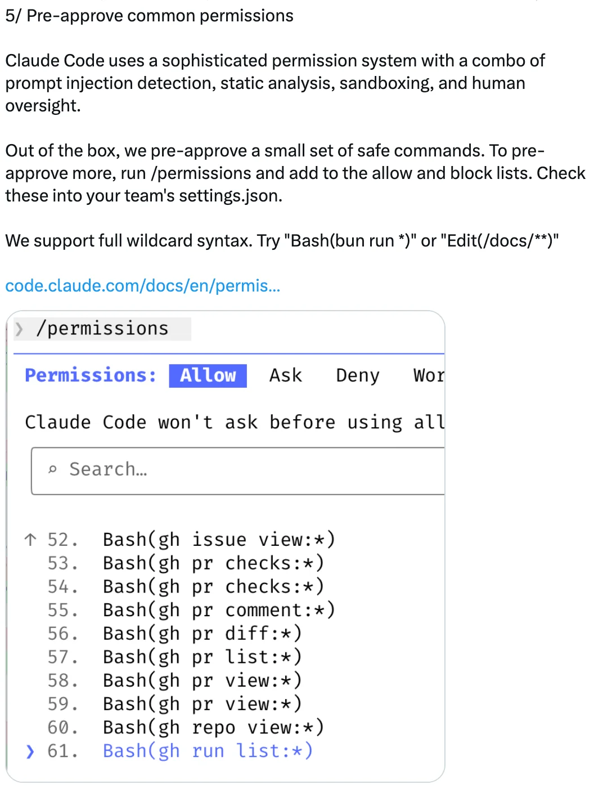
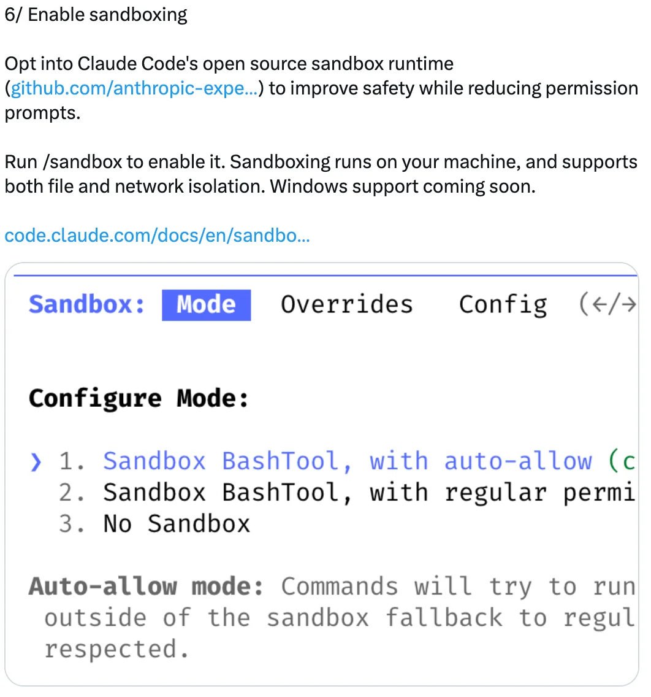
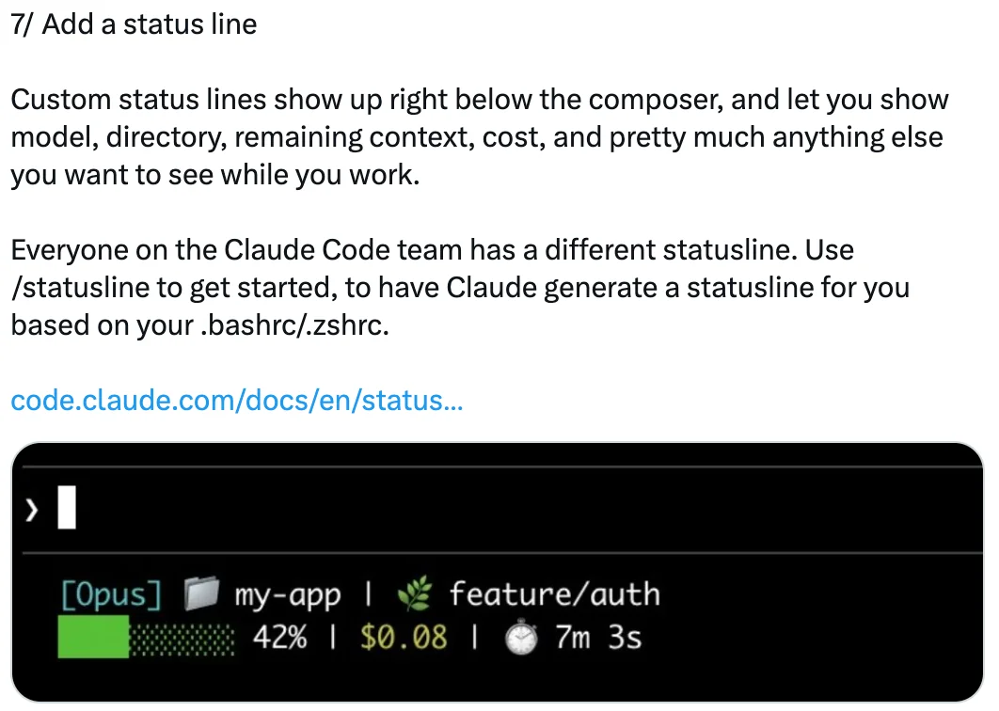
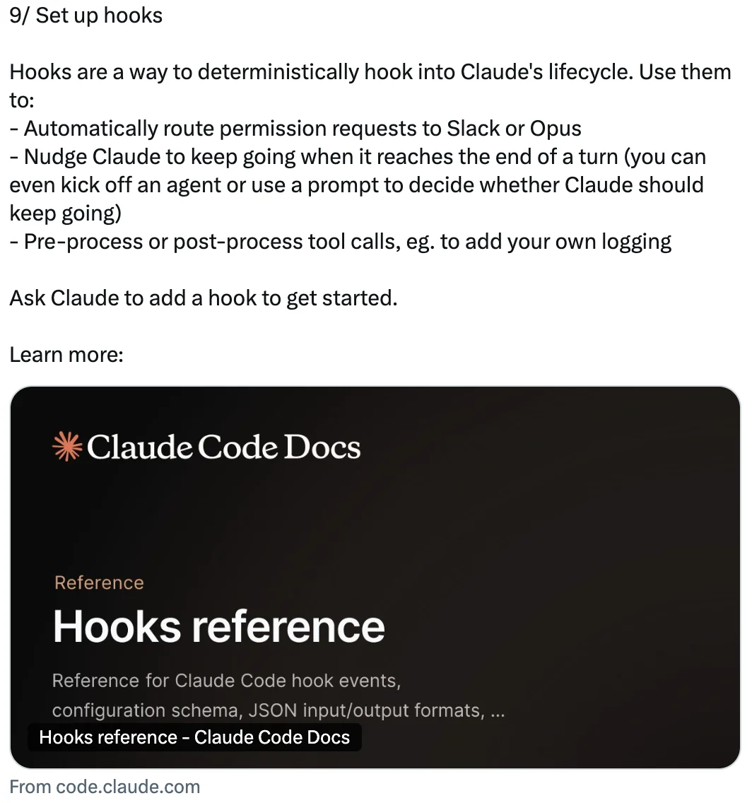
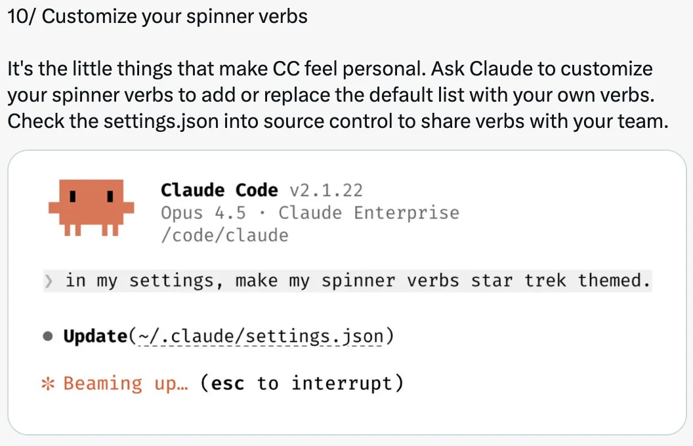
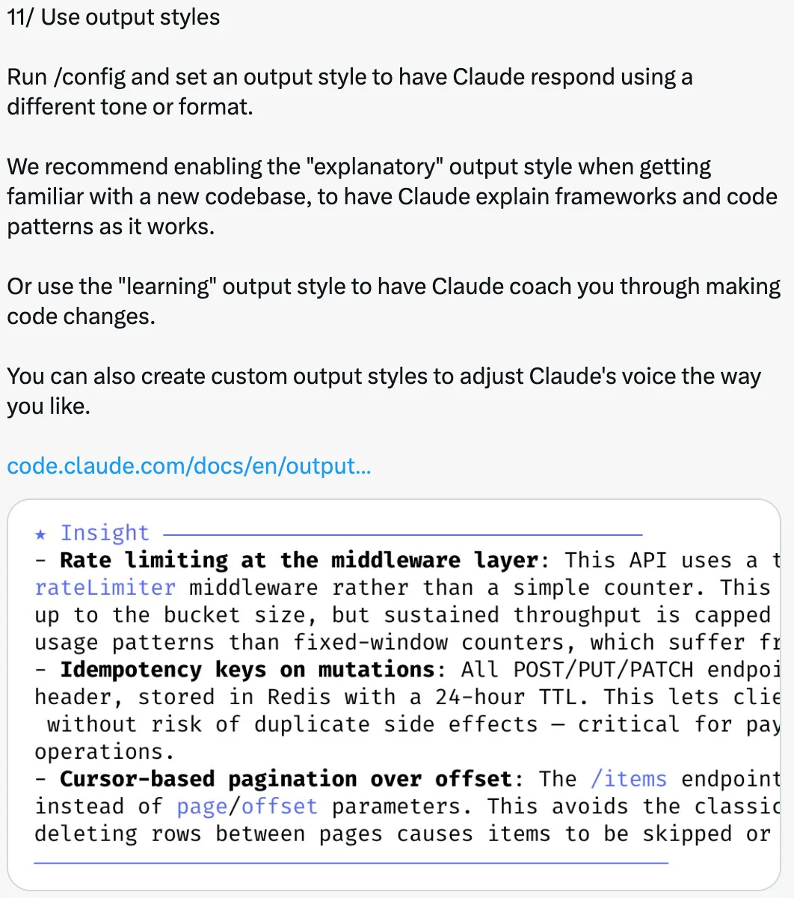

# 自定义 Claude Code 的 12 种方法 — 来自 Boris Cherny 的技巧

Boris Cherny ([@bcherny](https://x.com/bcherny))，Claude Code 创建者，于 2026 年 2 月 12 日分享的自定义技巧摘要。

<table width="100%">
<tr>
<td><a href="../">← 返回 Claude Code 最佳实践</a></td>
<td align="right"></td>
</tr>
</table>

---

## 背景

Boris Cherny 强调，可定制性是工程师最喜欢 Claude Code 的特性之一——钩子、插件、LSP、MCP、技能、工作量级别、自定义代理、状态栏、输出样式等等。他分享了开发者和团队自定义设置的 12 种实用方法。

---

## 1/ 配置你的终端

设置你的终端以获得最佳的 Claude Code 体验：

- **主题**：运行 `/config` 设置明暗模式
- **通知**：为 iTerm2 启用通知，或使用自定义通知钩子
- **换行**：如果在 IDE 终端、Apple Terminal、Warp 或 Alacritty 中使用 Claude Code，运行 `/terminal-setup` 启用 shift+enter 换行（这样你就不需要输入 `\`）
- **Vim 模式**：运行 `/vim`

---

## 2/ 调整工作量级别

运行 `/model` 选择你偏好的工作量级别：

- **低** — 更少的 token，更快的响应
- **中** — 平衡的行为
- **高** — 更多的 token，更高的智能

Boris 的偏好：所有事情都用高级别。

---

## 3/ 安装插件、MCP 和技能

插件让你可以安装 LSP（适用于所有主流语言）、MCP、技能、代理和自定义钩子。

从官方 Anthropic 插件市场安装，或为你的公司创建自己的市场。将 `settings.json` 提交到代码库以自动为团队添加市场。

运行 `/plugin` 开始使用。

---

## 4/ 创建自定义代理

在 `.claude/agents` 中放置 `.md` 文件来创建自定义代理。每个代理可以有自定义名称、颜色、工具集、预允许和预禁止的工具、权限模式和模型。

你还可以使用 `settings.json` 中的 `"agent"` 字段或 `--agent` 标志为主对话设置默认代理。

运行 `/agents` 开始使用。

---

## 5/ 预批准常用权限

Claude Code 使用结合提示注入检测、静态分析、沙箱和人工监督的权限系统。

开箱即用，一小部分安全命令已被预批准。要预批准更多命令，运行 `/permissions` 并添加到允许和阻止列表。将这些提交到团队的 `settings.json`。

支持完整的通配符语法 — 例如，`Bash(bun run *)` 或 `Edit(/docs/**)`。

---

## 6/ 启用沙箱

选择使用 Claude Code 的开源沙箱运行时，在减少权限提示的同时提高安全性。

运行 `/sandbox` 启用它。沙箱在你的机器上运行，支持文件和网络隔离。

---

## 7/ 添加状态栏

自定义状态栏显示在编辑器正下方，显示模型、目录、剩余上下文、成本以及你在工作时想看到的任何其他内容。

每个团队成员可以有不同的状态栏。使用 `/statusline` 让 Claude 根据你的 `.bashrc`/`.zshrc` 生成一个。

---

## 8/ 自定义键绑定

Claude Code 中的每个键绑定都是可自定义的。运行 `/keybindings` 重新映射任何键。设置实时重新加载，因此你可以立即看到感觉如何。

---

## 9/ 设置钩子

钩子让你可以确定性地接入 Claude 的生命周期：

- 自动将权限请求路由到 Slack 或 Opus
- 在 Claude 到达回合结束时推动它继续（你甚至可以启动一个代理或使用提示来决定 Claude 是否应该继续）
- 预处理或后处理工具调用，例如添加你自己的日志

让 Claude 添加一个钩子来开始使用。

---

## 10/ 自定义加载动词

自定义你的加载动词，添加或用你自己的动词替换默认列表。将 `settings.json` 提交到源代码控制以与团队共享动词。

---

## 11/ 使用输出样式

运行 `/config` 并设置输出样式，让 Claude 使用不同的语气或格式响应。

- **解释性** — 在熟悉新代码库时推荐使用，让 Claude 在工作时解释框架和代码模式
- **学习性** — 让 Claude 指导你进行代码更改
- **自定义** — 创建自定义输出样式以调整 Claude 的语气

---

## 12/ 自定义所有内容！

Claude Code 开箱即用效果很好，但当你进行自定义时，将你的 `settings.json` 提交到 git，这样你的团队也能受益。支持多个级别的配置：

- 针对你的代码库
- 针对子文件夹
- 仅针对你自己
- 通过企业范围的策略

有 37 个设置和 84 个环境变量（在 `settings.json` 中使用 `"env"` 字段以避免包装脚本），你想要的任何行为都很可能是可配置的。

---

## 来源

- [Boris Cherny (@bcherny) 在 X 上 — 2026 年 2 月 12 日](https://x.com/bcherny)
- [Claude Code Terminal Setup Docs](https://code.claude.com/docs/en/terminal)
- [Claude Code Plugins & Discovery Docs](https://code.claude.com/docs/en/discover-plugins)
- [Claude Code Sub-agents Docs](https://code.claude.com/docs/en/sub-agents)
- [Claude Code Permissions Docs](https://code.claude.com/docs/en/permissions)
- [Claude Code Sandbox Docs](https://code.claude.com/docs/en/sandbox)
- [Claude Code Status Line Docs](https://code.claude.com/docs/en/statusline)
- [Claude Code Keyboard Shortcuts Docs](https://code.claude.com/docs/en/keybindings)
- [Claude Code Hooks Reference](https://code.claude.com/docs/en/hooks)
- [Claude Code Output Styles Docs](https://code.claude.com/docs/en/output-styles)
- [Claude Code Settings Docs](https://code.claude.com/docs/en/settings)
