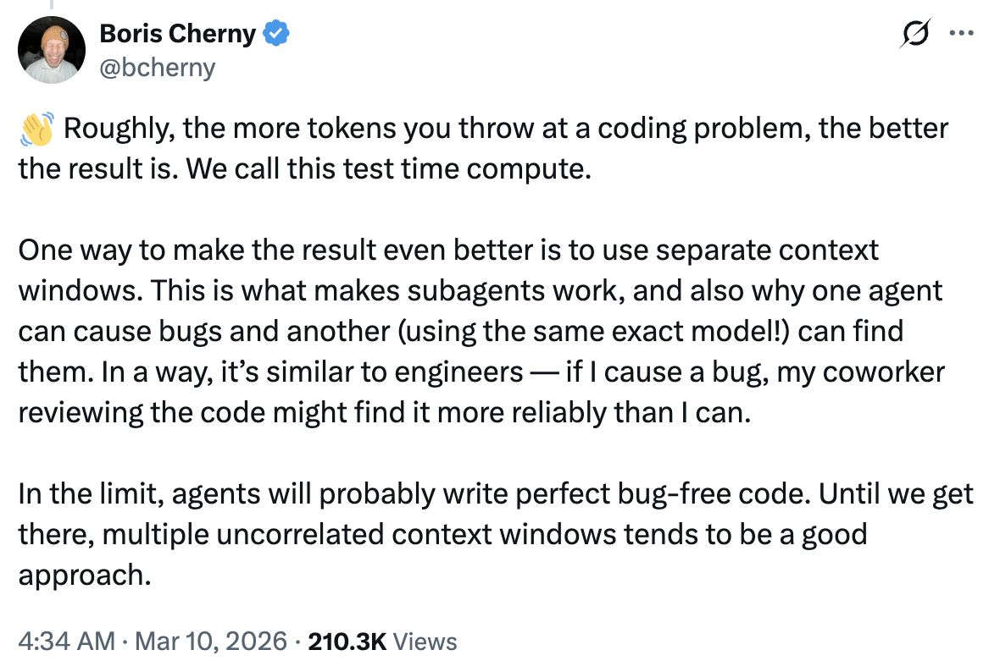

# 代码审查与测试时计算 — 来自 Boris Cherny 的技巧

Boris Cherny ([@bcherny](https://x.com/bcherny))，Claude Code 的创造者，于 2026 年 3 月 10 日分享的见解摘要。

<table width="100%">
<tr>
<td><a href="../">← 返回 Claude Code 最佳实践</a></td>
<td align="right"></td>
</tr>
</table>

---

## 1/ 介绍代码审查

Claude Code 的新功能：**代码审查**。一个智能体团队对每个 PR 进行深度审查。

- 首先为 Anthropic 自己的团队构建 — 每位工程师的代码输出**今年增长了 200%**，而审查是瓶颈
- Boris 使用了几周，发现它捕获了许多他本来不会注意到的真正错误
- 当 PR 打开时，Claude 会派遣一个智能体团队来寻找错误

---

## 2/ 测试时计算和多个上下文窗口

粗略地说，你向编码问题投入的令牌越多，结果就越好。Boris 将此称为**测试时计算**。

- 使用**独立的上下文窗口**使结果更好 — 这就是子智能体工作的原因，也是为什么一个智能体可能导致错误，而另一个（使用完全相同的模型）可以找到它们
- 类似于工程团队：如果 Boris 导致了一个错误，他的同事审查代码可能比他更可靠地找到它
- 在极限情况下，智能体可能会编写完美的无错误代码 — 在那之前，**多个不相关的上下文窗口**往往是一个好方法

---

## 来源

- [Boris Cherny (@bcherny) 在 X 上 — 2026 年 3 月 10 日](https://x.com/bcherny)
