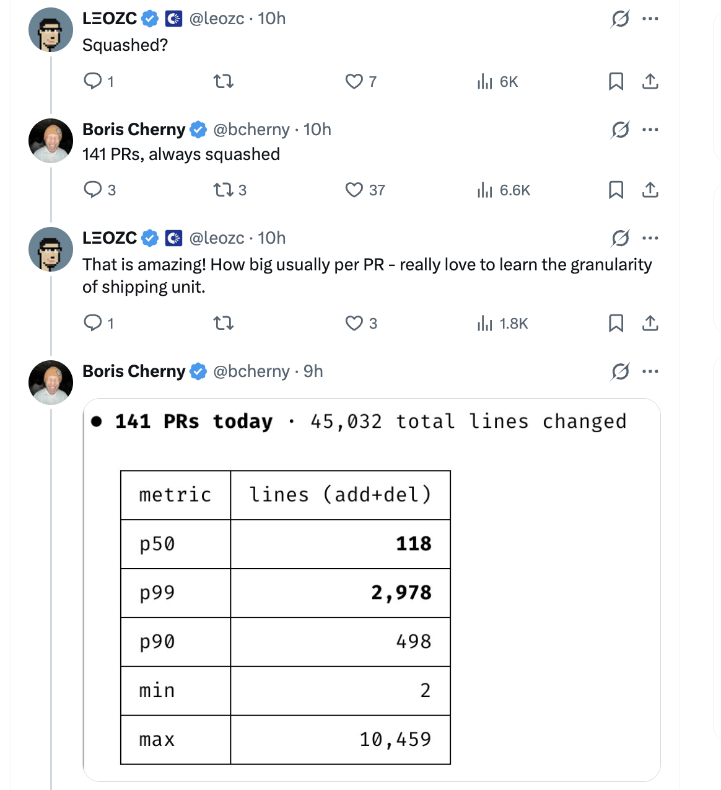

# 压缩合并与 PR 规模分布 — 来自 Boris Cherny 的技巧

总结 Claude Code 创建者 Boris Cherny ([@bcherny](https://x.com/bcherny)) 于 2026 年 3 月 25 日分享的见解。

<table width="100%">
<tr>
<td><a href="../">← 返回 Claude Code 最佳实践</a></td>
<td align="right"></td>
</tr>
</table>

---

## 1/ 单日 266 次提交 — 始终使用压缩合并

Boris 分享了他的 GitHub 贡献图，显示**3 月 24 日有 266 次贡献** — 来自 **141 个 PR，始终使用压缩合并**，每个 PR 的中位数为 **118 行**。

- 压缩合并将分支上的所有提交合并为目标分支上的单个提交 — 保持历史记录干净且线性
- 每个 PR = 一个提交，这使得回退整个功能变得容易，并简化了 `git bisect`
- 在高速 AI 辅助工作流中（141 个 PR/天），压缩合并是务实的选择 — 分支内的单个"修复 lint"、"试试这个"等提交都是噪音

---

## 2/ PR 规模分布 — 保持 PR 小型化

Boris 分享了这 141 个 PR 的规模分布，总计 **45,032 行变更**（新增 + 删除）：

| 指标 | 行数（新增+删除） | 含义 |
|--------|---------------:|---------|
| **p50** | **118** | PR 中位数规模 — 一半的 PR 为 118 行或更少 |
| p90 | 498 | 90% 的 PR 少于 500 行 |
| **p99** | **2,978** | 只有约 1 个 PR 超过约 3K 行 |
| min | 2 | 最小的 PR — 快速的 2 行修复 |
| max | 10,459 | 最大的单个 PR — 可能是迁移或生成的代码 |

- **中位数 118 行**意味着大多数 PR 都是专注且可审查的，即使在每天 141 个 PR 的情况下
- 分布严重右偏 — 偶尔的大型 PR 是不可避免的（批量重命名、迁移），但常态是紧凑的
- 小型 PR 降低合并冲突风险，更易于审查，并与压缩合并完美配合，实现干净的回退

---

## 来源

- [Boris Cherny (@bcherny) on X — 2026 年 3 月 25 日](https://x.com/bcherny)
